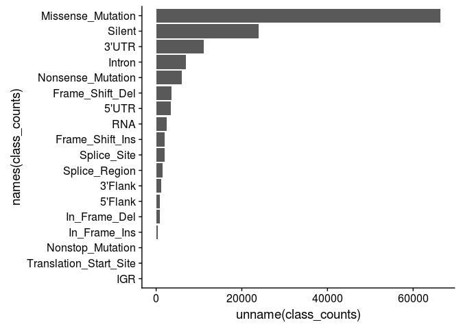

Exploring TCGA
================

Load dependencies
-----------------

``` r
library(tidyverse)
```

    ## ── Attaching packages ─────────────────────────────────────── tidyverse 1.2.1 ──

    ## ✔ ggplot2 2.2.1     ✔ purrr   0.2.4
    ## ✔ tibble  1.4.2     ✔ dplyr   0.7.4
    ## ✔ tidyr   0.8.0     ✔ stringr 1.3.0
    ## ✔ readr   1.1.1     ✔ forcats 0.3.0

    ## ── Conflicts ────────────────────────────────────────── tidyverse_conflicts() ──
    ## ✖ dplyr::filter() masks stats::filter()
    ## ✖ dplyr::lag()    masks stats::lag()

``` r
library(cowplot)
```

    ## 
    ## Attaching package: 'cowplot'

    ## The following object is masked from 'package:ggplot2':
    ## 
    ##     ggsave

1 Reading & Cleaning
====================

Define where the data lives
---------------------------

``` r
## Define data paths
in_path_varscan = 'data/maf/6c93f518-1956-4435-9806-37185266d248/TCGA.BRCA.varscan.6c93f518-1956-4435-9806-37185266d248.DR-10.0.somatic.maf.gz'
in_path_muse = 'data/maf/b8ca5856-9819-459c-87c5-94e91aca4032/TCGA.BRCA.muse.b8ca5856-9819-459c-87c5-94e91aca4032.DR-10.0.somatic.maf.gz'
in_path_ss = 'data/maf/7dd592e3-5950-4438-96d5-3c718aca3f13/TCGA.BRCA.somaticsniper.7dd592e3-5950-4438-96d5-3c718aca3f13.DR-10.0.somatic.maf.gz'
in_path_mutect = 'data/maf/995c0111-d90b-4140-bee7-3845436c3b42/TCGA.BRCA.mutect.995c0111-d90b-4140-bee7-3845436c3b42.DR-10.0.somatic.maf.gz'
```

Reading data
------------

``` r
df = read_tsv(
  in_path_mutect,
  comment = '#'
)
```

Preview data
------------

``` r
print(dim(df))
```

    ## NULL

``` r
head(df, 10)
```

    ##                                               
    ## 1 function (x, df1, df2, ncp, log = FALSE)    
    ## 2 {                                           
    ## 3     if (missing(ncp))                       
    ## 4         .Call(C_df, x, df1, df2, log)       
    ## 5     else .Call(C_dnf, x, df1, df2, ncp, log)
    ## 6 }

Read & concatenate multiple files
---------------------------------

``` r
## Define column types
col_types = cols_only(
  Chromosome = 'c',
  Start_Position = 'i',
  End_Position = 'i',
  SYMBOL = 'c',
  Reference_Allele = 'c',
  Allele = 'c', 
  Variant_Classification = 'c', 
  IMPACT = 'c',
  Variant_Type = 'c',
  Tumor_Sample_Barcode = 'c'
)

## Concatenate vertically
in_paths = c(
  in_path_varscan,
  in_path_muse,
  in_path_ss,
  in_path_mutect
)
df = bind_rows(lapply(
  in_paths, 
  read_tsv, 
  col_types = col_types,
  comment = '#'
))

## Convert characters to factors
# Note, if we weren't concatenating,
# this could be done while reading 
# by specifying 
# `COL_NAME = col_factor(levels=NULL)`
# inside cols_only()
df = mutate_if(
  df,
  is.character,
  as.factor
)

print(dim(df))
```

    ## [1] 370461     10

``` r
head(df)
```

    ## # A tibble: 6 x 10
    ##   Chromosome Start_Position End_Position Variant_Classificat… Variant_Type
    ##   <fct>               <int>        <int> <fct>                <fct>       
    ## 1 chr1              1916819      1916819 Missense_Mutation    SNP         
    ## 2 chr1              2172304      2172304 Missense_Mutation    SNP         
    ## 3 chr1              3766586      3766586 Missense_Mutation    SNP         
    ## 4 chr1              6040634      6040634 Silent               SNP         
    ## 5 chr1             23961791     23961791 Missense_Mutation    SNP         
    ## 6 chr1             28236188     28236188 Missense_Mutation    SNP         
    ## # ... with 5 more variables: Reference_Allele <fct>,
    ## #   Tumor_Sample_Barcode <fct>, Allele <fct>, SYMBOL <fct>, IMPACT <fct>

Rename and reorder columns
--------------------------

``` r
## Rename
col_name_map = list(
  CHR = 'Chromosome',
  START = 'Start_Position',
  END = 'End_Position',
  GENE = 'SYMBOL',
  REF = 'Reference_Allele',
  ALT = 'Allele',
  CLASS = 'Variant_Classification',
  IMPACT = 'IMPACT',
  TYPE = 'Variant_Type',
  BARCODE = 'Tumor_Sample_Barcode'
)
df = rename(df, !!! col_name_map)

## Reorder
keep_cols = names(col_name_map)
df = select(df, keep_cols)

head(df)
```

    ## # A tibble: 6 x 10
    ##   CHR      START      END GENE   REF   ALT   CLASS   IMPACT TYPE  BARCODE 
    ##   <fct>    <int>    <int> <fct>  <fct> <fct> <fct>   <fct>  <fct> <fct>   
    ## 1 chr1   1916819  1916819 CALML6 C     G     Missen… MODER… SNP   TCGA-A2…
    ## 2 chr1   2172304  2172304 PRKCZ  G     C     Missen… MODER… SNP   TCGA-A2…
    ## 3 chr1   3766586  3766586 CCDC27 G     A     Missen… MODER… SNP   TCGA-A2…
    ## 4 chr1   6040634  6040634 KCNAB2 G     C     Silent  LOW    SNP   TCGA-A2…
    ## 5 chr1  23961791 23961791 PNRC2  A     G     Missen… MODER… SNP   TCGA-A2…
    ## 6 chr1  28236188 28236188 ATPIF1 C     G     Missen… MODER… SNP   TCGA-A2…

Fill missing data
-----------------

``` r
levels(df$GENE) = c(levels(df$GENE), 'INTERGENIC')
df$GENE[is.na(df$GENE)] = 'INTERGENIC'
```

Create new columns from string ops
----------------------------------

``` r
## New columns by assignment
df$SAMPLE = str_sub(df$BARCODE, 1, 12)
df$MUTATION = paste(
  df$CHR, 
  df$GENE,
  df$START,
  df$END,
  df$REF,
  df$ALT,
  sep = ':'
)
df$TYPE2 = ifelse(df$TYPE == 'SNP', 'SNP', 'INDEL')

## New columns with mutate()
# Equivalent to above (and thus redundant)
df = mutate(
  df,
  SAMPLE = str_sub(BARCODE, 1, 12),
  MUTATION = paste(
    CHR,
    GENE,
    START,
    END,
    REF,
    ALT,
    sep = ':'
  ),
  TYPE2 = ifelse(TYPE == 'SNP', 'SNP', 'INDEL')
)

## Convert new columns to factors if applicable,
## possibly with manually-set levels
df$SAMPLE = as.factor(df$SAMPLE)
df$MUTATION = as.factor(df$MUTATION)
df$TYPE2 = factor(df$TYPE2, levels = c('SNP', 'INDEL'))

print(dim(df))
```

    ## [1] 370461     13

``` r
head(df)
```

    ## # A tibble: 6 x 13
    ##   CHR     START    END GENE  REF   ALT   CLASS IMPACT TYPE  BARCODE SAMPLE
    ##   <fct>   <int>  <int> <fct> <fct> <fct> <fct> <fct>  <fct> <fct>   <fct> 
    ## 1 chr1   1.92e6 1.92e6 CALM… C     G     Miss… MODER… SNP   TCGA-A… TCGA-…
    ## 2 chr1   2.17e6 2.17e6 PRKCZ G     C     Miss… MODER… SNP   TCGA-A… TCGA-…
    ## 3 chr1   3.77e6 3.77e6 CCDC… G     A     Miss… MODER… SNP   TCGA-A… TCGA-…
    ## 4 chr1   6.04e6 6.04e6 KCNA… G     C     Sile… LOW    SNP   TCGA-A… TCGA-…
    ## 5 chr1   2.40e7 2.40e7 PNRC2 A     G     Miss… MODER… SNP   TCGA-A… TCGA-…
    ## 6 chr1   2.82e7 2.82e7 ATPI… C     G     Miss… MODER… SNP   TCGA-A… TCGA-…
    ## # ... with 2 more variables: MUTATION <fct>, TYPE2 <fct>

Remove duplicates
-----------------

``` r
## Remove duplicate rows
df = unique(df)

## Remove duplicate based on column
df_mut = df[!duplicated(df$MUTATION),]

print(dim(df))
```

    ## [1] 132916     13

``` r
print(dim(df_mut))
```

    ## [1] 130625     13

Remove columns
--------------

``` r
drop_cols = c('BARCODE', 'SAMPLE')
df_mut = select(df_mut, -one_of(drop_cols))

print(dim(df_mut))
```

    ## [1] 130625     11

``` r
head(df_mut)
```

    ## # A tibble: 6 x 11
    ##   CHR     START    END GENE  REF   ALT   CLASS IMPACT TYPE  MUTATION TYPE2
    ##   <fct>   <int>  <int> <fct> <fct> <fct> <fct> <fct>  <fct> <fct>    <fct>
    ## 1 chr1   1.92e6 1.92e6 CALM… C     G     Miss… MODER… SNP   chr1:CA… SNP  
    ## 2 chr1   2.17e6 2.17e6 PRKCZ G     C     Miss… MODER… SNP   chr1:PR… SNP  
    ## 3 chr1   3.77e6 3.77e6 CCDC… G     A     Miss… MODER… SNP   chr1:CC… SNP  
    ## 4 chr1   6.04e6 6.04e6 KCNA… G     C     Sile… LOW    SNP   chr1:KC… SNP  
    ## 5 chr1   2.40e7 2.40e7 PNRC2 A     G     Miss… MODER… SNP   chr1:PN… SNP  
    ## 6 chr1   2.82e7 2.82e7 ATPI… C     G     Miss… MODER… SNP   chr1:AT… SNP

New columns from delimited column
---------------------------------

``` r
## Create dummy frame
df_tmp = df
drop_cols = c(
    'CHR',
    'GENE',
    'START',
    'END',
    'REF',
    'ALT'
)
df_tmp = select(df_tmp, -one_of(drop_cols))

## Create new columns
df_tmp = separate(
  df_tmp,
  MUTATION,
  drop_cols,
  ':'
)

print(dim(df_tmp))
```

    ## [1] 132916     12

``` r
head(df_tmp)
```

    ## # A tibble: 6 x 12
    ##   CLASS  IMPACT  TYPE  BARCODE  SAMPLE CHR   GENE  START END   REF   ALT  
    ##   <fct>  <fct>   <fct> <fct>    <fct>  <chr> <chr> <chr> <chr> <chr> <chr>
    ## 1 Misse… MODERA… SNP   TCGA-A2… TCGA-… chr1  CALM… 1916… 1916… C     G    
    ## 2 Misse… MODERA… SNP   TCGA-A2… TCGA-… chr1  PRKCZ 2172… 2172… G     C    
    ## 3 Misse… MODERA… SNP   TCGA-A2… TCGA-… chr1  CCDC… 3766… 3766… G     A    
    ## 4 Silent LOW     SNP   TCGA-A2… TCGA-… chr1  KCNA… 6040… 6040… G     C    
    ## 5 Misse… MODERA… SNP   TCGA-A2… TCGA-… chr1  PNRC2 2396… 2396… A     G    
    ## 6 Misse… MODERA… SNP   TCGA-A2… TCGA-… chr1  ATPI… 2823… 2823… C     G    
    ## # ... with 1 more variable: TYPE2 <fct>

Writing files
-------------

``` r
write_delim(
  df, 
  'data/out/df_r.tsv', 
  delim = '\t'
)
```

Read & write binary files
-------------------------

``` r
rds_path = 'data/out/df.rds'

## Write
saveRDS(df, rds_path)

## Read
df = readRDS(rds_path)
```

Long to wide
------------

``` r
## Shorten to relevant columns
# Note, we could include other columns here
# like GENE and IMPACT, but we won't 
# to match the python example.

## Create a dummy column w/ fill value
df_tmp = select(df, c('SAMPLE', 'MUTATION'))
df_tmp$EXISTS = 1

## Long-to-wide
df_wide = spread(
  df_tmp,
  key = 'SAMPLE',
  value = 'EXISTS',
  fill = 0
)
rm(df_tmp)

print(dim(df_wide))
```

    ## [1] 130625    987

``` r
head(df_wide)
```

    ## # A tibble: 6 x 987
    ##   MUTATION     `TCGA-3C-AAAU` `TCGA-3C-AALI` `TCGA-3C-AALJ` `TCGA-3C-AALK`
    ##   <fct>                 <dbl>          <dbl>          <dbl>          <dbl>
    ## 1 chr10:A1CF:…             0.             0.             0.             0.
    ## 2 chr10:A1CF:…             0.             0.             0.             0.
    ## 3 chr10:A1CF:…             0.             0.             0.             0.
    ## 4 chr10:A1CF:…             0.             0.             0.             0.
    ## 5 chr10:A1CF:…             0.             0.             0.             0.
    ## 6 chr10:A1CF:…             0.             0.             0.             0.
    ## # ... with 982 more variables: `TCGA-4H-AAAK` <dbl>, `TCGA-5L-AAT0` <dbl>,
    ## #   `TCGA-5L-AAT1` <dbl>, `TCGA-5T-A9QA` <dbl>, `TCGA-A1-A0SD` <dbl>,
    ## #   `TCGA-A1-A0SE` <dbl>, `TCGA-A1-A0SF` <dbl>, `TCGA-A1-A0SG` <dbl>,
    ## #   `TCGA-A1-A0SH` <dbl>, `TCGA-A1-A0SI` <dbl>, `TCGA-A1-A0SJ` <dbl>,
    ## #   `TCGA-A1-A0SK` <dbl>, `TCGA-A1-A0SM` <dbl>, `TCGA-A1-A0SN` <dbl>,
    ## #   `TCGA-A1-A0SO` <dbl>, `TCGA-A1-A0SP` <dbl>, `TCGA-A1-A0SQ` <dbl>,
    ## #   `TCGA-A2-A04N` <dbl>, `TCGA-A2-A04P` <dbl>, `TCGA-A2-A04Q` <dbl>,
    ## #   `TCGA-A2-A04R` <dbl>, `TCGA-A2-A04T` <dbl>, `TCGA-A2-A04U` <dbl>,
    ## #   `TCGA-A2-A04V` <dbl>, `TCGA-A2-A04W` <dbl>, `TCGA-A2-A04X` <dbl>,
    ## #   `TCGA-A2-A04Y` <dbl>, `TCGA-A2-A0CK` <dbl>, `TCGA-A2-A0CL` <dbl>,
    ## #   `TCGA-A2-A0CM` <dbl>, `TCGA-A2-A0CP` <dbl>, `TCGA-A2-A0CQ` <dbl>,
    ## #   `TCGA-A2-A0CR` <dbl>, `TCGA-A2-A0CS` <dbl>, `TCGA-A2-A0CT` <dbl>,
    ## #   `TCGA-A2-A0CU` <dbl>, `TCGA-A2-A0CV` <dbl>, `TCGA-A2-A0CW` <dbl>,
    ## #   `TCGA-A2-A0CX` <dbl>, `TCGA-A2-A0D0` <dbl>, `TCGA-A2-A0D1` <dbl>,
    ## #   `TCGA-A2-A0D2` <dbl>, `TCGA-A2-A0D3` <dbl>, `TCGA-A2-A0D4` <dbl>,
    ## #   `TCGA-A2-A0EM` <dbl>, `TCGA-A2-A0EN` <dbl>, `TCGA-A2-A0EO` <dbl>,
    ## #   `TCGA-A2-A0EP` <dbl>, `TCGA-A2-A0EQ` <dbl>, `TCGA-A2-A0ER` <dbl>,
    ## #   `TCGA-A2-A0ES` <dbl>, `TCGA-A2-A0ET` <dbl>, `TCGA-A2-A0EU` <dbl>,
    ## #   `TCGA-A2-A0EV` <dbl>, `TCGA-A2-A0EW` <dbl>, `TCGA-A2-A0EX` <dbl>,
    ## #   `TCGA-A2-A0EY` <dbl>, `TCGA-A2-A0ST` <dbl>, `TCGA-A2-A0SU` <dbl>,
    ## #   `TCGA-A2-A0SV` <dbl>, `TCGA-A2-A0SW` <dbl>, `TCGA-A2-A0SX` <dbl>,
    ## #   `TCGA-A2-A0SY` <dbl>, `TCGA-A2-A0T0` <dbl>, `TCGA-A2-A0T1` <dbl>,
    ## #   `TCGA-A2-A0T2` <dbl>, `TCGA-A2-A0T3` <dbl>, `TCGA-A2-A0T4` <dbl>,
    ## #   `TCGA-A2-A0T5` <dbl>, `TCGA-A2-A0T6` <dbl>, `TCGA-A2-A0T7` <dbl>,
    ## #   `TCGA-A2-A0YC` <dbl>, `TCGA-A2-A0YD` <dbl>, `TCGA-A2-A0YE` <dbl>,
    ## #   `TCGA-A2-A0YF` <dbl>, `TCGA-A2-A0YG` <dbl>, `TCGA-A2-A0YH` <dbl>,
    ## #   `TCGA-A2-A0YI` <dbl>, `TCGA-A2-A0YJ` <dbl>, `TCGA-A2-A0YK` <dbl>,
    ## #   `TCGA-A2-A0YL` <dbl>, `TCGA-A2-A0YM` <dbl>, `TCGA-A2-A0YT` <dbl>,
    ## #   `TCGA-A2-A1FV` <dbl>, `TCGA-A2-A1FW` <dbl>, `TCGA-A2-A1FX` <dbl>,
    ## #   `TCGA-A2-A1FZ` <dbl>, `TCGA-A2-A1G0` <dbl>, `TCGA-A2-A1G1` <dbl>,
    ## #   `TCGA-A2-A1G4` <dbl>, `TCGA-A2-A1G6` <dbl>, `TCGA-A2-A259` <dbl>,
    ## #   `TCGA-A2-A25A` <dbl>, `TCGA-A2-A25B` <dbl>, `TCGA-A2-A25C` <dbl>,
    ## #   `TCGA-A2-A25D` <dbl>, `TCGA-A2-A25E` <dbl>, `TCGA-A2-A25F` <dbl>,
    ## #   `TCGA-A2-A3KD` <dbl>, `TCGA-A2-A3XT` <dbl>, …

Merge
-----

``` r
## Select columns to add on and col to join on
cols = c('MUTATION', 'GENE', 'IMPACT')

## Merge
df_wide = merge(
  df_wide, select(df_mut, cols),
  by = 'MUTATION',
  all.x = TRUE
)

## Re-order columns
# Put new columns first
df_wide = select(df_wide, cols, everything())

# Note, first 3 columns are out of order 
# w/ python example.
print(dim(df_wide))
```

    ## [1] 130625    989

``` r
head(df_wide)
```

    ##                           MUTATION GENE   IMPACT TCGA-3C-AAAU TCGA-3C-AALI
    ## 1 chr10:A1CF:50813906:50813906:G:- A1CF     HIGH            0            0
    ## 2 chr10:A1CF:50813932:50813932:G:T A1CF MODERATE            0            0
    ## 3 chr10:A1CF:50828193:50828193:C:A A1CF MODERATE            0            0
    ## 4 chr10:A1CF:50836094:50836094:G:A A1CF MODERATE            0            0
    ## 5 chr10:A1CF:50836177:50836177:G:A A1CF      LOW            0            0
    ## 6 chr10:A1CF:50836181:50836181:A:T A1CF MODERATE            0            0
    ##   TCGA-3C-AALJ TCGA-3C-AALK TCGA-4H-AAAK TCGA-5L-AAT0 TCGA-5L-AAT1
    ## 1            0            0            0            0            0
    ## 2            0            0            0            0            0
    ## 3            0            0            0            0            0
    ## 4            0            0            0            0            0
    ## 5            0            0            0            0            0
    ## 6            0            0            0            0            0
    ##   TCGA-5T-A9QA TCGA-A1-A0SD TCGA-A1-A0SE TCGA-A1-A0SF TCGA-A1-A0SG
    ## 1            0            0            0            0            0
    ## 2            0            0            0            0            0
    ## 3            0            0            0            0            0
    ## 4            0            0            0            0            0
    ## 5            0            0            0            0            0
    ## 6            0            0            0            0            0
    ##   TCGA-A1-A0SH TCGA-A1-A0SI TCGA-A1-A0SJ TCGA-A1-A0SK TCGA-A1-A0SM
    ## 1            0            0            0            0            0
    ## 2            0            0            0            0            0
    ## 3            0            0            0            0            0
    ## 4            0            0            0            0            0
    ## 5            0            0            0            0            0
    ## 6            0            0            0            0            0
    ##   TCGA-A1-A0SN TCGA-A1-A0SO TCGA-A1-A0SP TCGA-A1-A0SQ TCGA-A2-A04N
    ## 1            0            0            0            0            0
    ## 2            0            0            0            0            0
    ## 3            0            0            0            0            0
    ## 4            0            0            0            0            0
    ## 5            0            0            0            0            0
    ## 6            0            0            0            0            0
    ##   TCGA-A2-A04P TCGA-A2-A04Q TCGA-A2-A04R TCGA-A2-A04T TCGA-A2-A04U
    ## 1            0            0            0            0            0
    ## 2            0            0            0            0            0
    ## 3            0            0            0            0            0
    ## 4            0            0            0            0            0
    ## 5            0            0            0            0            0
    ## 6            0            0            0            0            0
    ##   TCGA-A2-A04V TCGA-A2-A04W TCGA-A2-A04X TCGA-A2-A04Y TCGA-A2-A0CK
    ## 1            0            0            0            0            0
    ## 2            0            0            0            0            0
    ## 3            0            0            0            0            0
    ## 4            0            0            0            0            0
    ## 5            0            0            0            0            0
    ## 6            0            0            0            0            0
    ##   TCGA-A2-A0CL TCGA-A2-A0CM TCGA-A2-A0CP TCGA-A2-A0CQ TCGA-A2-A0CR
    ## 1            0            0            0            0            0
    ## 2            0            0            0            0            0
    ## 3            0            0            0            0            0
    ## 4            0            0            0            0            0
    ## 5            0            0            0            0            0
    ## 6            0            0            0            0            0
    ##   TCGA-A2-A0CS TCGA-A2-A0CT TCGA-A2-A0CU TCGA-A2-A0CV TCGA-A2-A0CW
    ## 1            0            0            0            0            0
    ## 2            0            0            0            0            0
    ## 3            0            0            0            0            0
    ## 4            0            0            0            0            0
    ## 5            0            0            0            0            0
    ## 6            0            0            0            0            0
    ##   TCGA-A2-A0CX TCGA-A2-A0D0 TCGA-A2-A0D1 TCGA-A2-A0D2 TCGA-A2-A0D3
    ## 1            0            0            0            0            0
    ## 2            0            0            0            0            0
    ## 3            0            0            0            0            0
    ## 4            0            0            0            0            0
    ## 5            0            0            0            0            0
    ## 6            0            0            0            0            0
    ##   TCGA-A2-A0D4 TCGA-A2-A0EM TCGA-A2-A0EN TCGA-A2-A0EO TCGA-A2-A0EP
    ## 1            0            0            0            0            0
    ## 2            0            0            0            0            0
    ## 3            0            0            0            0            0
    ## 4            0            0            0            0            0
    ## 5            0            0            0            0            0
    ## 6            0            0            0            0            0
    ##   TCGA-A2-A0EQ TCGA-A2-A0ER TCGA-A2-A0ES TCGA-A2-A0ET TCGA-A2-A0EU
    ## 1            0            0            0            0            0
    ## 2            0            0            0            0            0
    ## 3            0            0            0            0            0
    ## 4            0            0            0            0            0
    ## 5            0            0            0            0            0
    ## 6            0            0            0            0            0
    ##   TCGA-A2-A0EV TCGA-A2-A0EW TCGA-A2-A0EX TCGA-A2-A0EY TCGA-A2-A0ST
    ## 1            0            0            0            0            0
    ## 2            0            0            0            0            0
    ## 3            0            0            0            0            0
    ## 4            0            0            0            0            0
    ## 5            0            0            0            0            0
    ## 6            0            0            0            0            0
    ##   TCGA-A2-A0SU TCGA-A2-A0SV TCGA-A2-A0SW TCGA-A2-A0SX TCGA-A2-A0SY
    ## 1            0            0            0            0            0
    ## 2            0            0            0            0            0
    ## 3            0            0            0            0            0
    ## 4            0            0            0            0            0
    ## 5            0            0            0            0            0
    ## 6            0            0            0            0            0
    ##   TCGA-A2-A0T0 TCGA-A2-A0T1 TCGA-A2-A0T2 TCGA-A2-A0T3 TCGA-A2-A0T4
    ## 1            0            0            0            0            0
    ## 2            0            0            0            0            0
    ## 3            0            0            0            0            0
    ## 4            0            0            0            0            0
    ## 5            0            0            0            0            0
    ## 6            0            0            0            0            0
    ##   TCGA-A2-A0T5 TCGA-A2-A0T6 TCGA-A2-A0T7 TCGA-A2-A0YC TCGA-A2-A0YD
    ## 1            0            0            0            0            0
    ## 2            0            0            0            0            0
    ## 3            0            0            0            0            0
    ## 4            0            0            0            0            0
    ## 5            0            0            0            0            0
    ## 6            0            0            0            0            0
    ##   TCGA-A2-A0YE TCGA-A2-A0YF TCGA-A2-A0YG TCGA-A2-A0YH TCGA-A2-A0YI
    ## 1            0            0            0            0            0
    ## 2            0            0            0            0            0
    ## 3            0            0            0            0            0
    ## 4            0            0            0            0            0
    ## 5            0            0            0            0            0
    ## 6            0            0            0            0            0
    ##   TCGA-A2-A0YJ TCGA-A2-A0YK TCGA-A2-A0YL TCGA-A2-A0YM TCGA-A2-A0YT
    ## 1            0            0            0            0            0
    ## 2            0            0            0            0            0
    ## 3            0            0            0            0            0
    ## 4            0            0            0            0            0
    ## 5            0            0            0            0            0
    ## 6            0            0            0            0            0
    ##   TCGA-A2-A1FV TCGA-A2-A1FW TCGA-A2-A1FX TCGA-A2-A1FZ TCGA-A2-A1G0
    ## 1            0            0            0            0            0
    ## 2            0            0            0            0            0
    ## 3            0            0            0            0            0
    ## 4            0            0            0            0            0
    ## 5            0            0            0            0            0
    ## 6            0            0            0            0            0
    ##   TCGA-A2-A1G1 TCGA-A2-A1G4 TCGA-A2-A1G6 TCGA-A2-A259 TCGA-A2-A25A
    ## 1            0            0            0            0            0
    ## 2            0            0            0            0            0
    ## 3            0            0            0            0            0
    ## 4            0            0            0            0            0
    ## 5            0            0            0            0            0
    ## 6            0            0            0            0            0
    ##   TCGA-A2-A25B TCGA-A2-A25C TCGA-A2-A25D TCGA-A2-A25E TCGA-A2-A25F
    ## 1            0            0            0            0            0
    ## 2            0            0            0            0            0
    ## 3            0            0            0            0            0
    ## 4            0            0            0            0            0
    ## 5            0            0            0            0            0
    ## 6            0            0            0            0            0
    ##   TCGA-A2-A3KD TCGA-A2-A3XT TCGA-A2-A3XU TCGA-A2-A3XV TCGA-A2-A3XW
    ## 1            0            0            0            0            0
    ## 2            0            0            0            0            0
    ## 3            0            0            0            0            0
    ## 4            0            0            0            0            0
    ## 5            0            0            0            0            0
    ## 6            0            0            0            0            0
    ##   TCGA-A2-A3XX TCGA-A2-A3XZ TCGA-A2-A3Y0 TCGA-A2-A4S1 TCGA-A2-A4S2
    ## 1            0            0            0            0            0
    ## 2            0            0            0            0            0
    ## 3            0            0            0            0            0
    ## 4            0            0            0            0            0
    ## 5            0            0            0            0            0
    ## 6            0            0            0            0            0
    ##   TCGA-A2-A4S3 TCGA-A7-A0CD TCGA-A7-A0CE TCGA-A7-A0CG TCGA-A7-A0CJ
    ## 1            0            0            0            0            0
    ## 2            0            0            0            0            0
    ## 3            0            0            0            0            0
    ## 4            0            0            0            0            0
    ## 5            0            0            0            0            0
    ## 6            0            0            0            0            0
    ##   TCGA-A7-A0D9 TCGA-A7-A0DA TCGA-A7-A0DB TCGA-A7-A13D TCGA-A7-A13E
    ## 1            0            0            0            0            0
    ## 2            0            0            0            0            0
    ## 3            0            0            0            0            0
    ## 4            0            0            0            0            0
    ## 5            0            0            0            0            0
    ## 6            0            0            0            0            0
    ##   TCGA-A7-A13F TCGA-A7-A13G TCGA-A7-A26E TCGA-A7-A26F TCGA-A7-A26G
    ## 1            0            0            0            0            0
    ## 2            0            0            0            0            0
    ## 3            0            0            0            0            0
    ## 4            0            0            0            0            0
    ## 5            0            0            0            0            0
    ## 6            0            0            0            0            0
    ##   TCGA-A7-A26H TCGA-A7-A26I TCGA-A7-A26J TCGA-A7-A2KD TCGA-A7-A3RF
    ## 1            0            0            0            0            0
    ## 2            0            0            0            0            0
    ## 3            0            0            0            0            0
    ## 4            0            0            0            0            0
    ## 5            0            0            0            0            0
    ## 6            0            0            0            0            0
    ##   TCGA-A7-A425 TCGA-A7-A4SC TCGA-A7-A4SD TCGA-A7-A4SE TCGA-A7-A56D
    ## 1            0            0            0            0            0
    ## 2            0            0            0            0            0
    ## 3            0            0            0            0            0
    ## 4            0            0            0            0            0
    ## 5            0            0            0            0            0
    ## 6            0            0            0            0            0
    ##   TCGA-A7-A5ZW TCGA-A7-A5ZX TCGA-A7-A6VV TCGA-A7-A6VW TCGA-A7-A6VX
    ## 1            0            0            0            0            0
    ## 2            0            0            0            0            0
    ## 3            0            0            0            0            0
    ## 4            0            0            0            0            0
    ## 5            0            0            0            0            0
    ## 6            0            0            0            0            0
    ##   TCGA-A7-A6VY TCGA-A8-A06O TCGA-A8-A06P TCGA-A8-A06Q TCGA-A8-A06R
    ## 1            0            0            0            0            0
    ## 2            0            0            0            0            0
    ## 3            0            0            0            0            0
    ## 4            0            0            0            0            0
    ## 5            0            0            0            0            0
    ## 6            0            0            0            0            0
    ##   TCGA-A8-A06T TCGA-A8-A06U TCGA-A8-A06X TCGA-A8-A06Y TCGA-A8-A06Z
    ## 1            0            0            0            0            0
    ## 2            0            0            0            0            0
    ## 3            0            0            0            0            0
    ## 4            0            0            0            0            0
    ## 5            0            0            0            0            0
    ## 6            0            0            0            0            0
    ##   TCGA-A8-A075 TCGA-A8-A076 TCGA-A8-A079 TCGA-A8-A07B TCGA-A8-A07F
    ## 1            0            0            0            0            0
    ## 2            0            0            0            0            0
    ## 3            0            0            0            0            0
    ## 4            0            0            0            0            0
    ## 5            0            0            0            0            0
    ## 6            0            0            0            0            0
    ##   TCGA-A8-A07G TCGA-A8-A07I TCGA-A8-A07J TCGA-A8-A07L TCGA-A8-A07O
    ## 1            0            0            0            0            0
    ## 2            0            0            0            0            0
    ## 3            0            0            0            0            0
    ## 4            0            0            0            0            0
    ## 5            0            0            0            0            0
    ## 6            0            0            0            0            0
    ##   TCGA-A8-A07P TCGA-A8-A07U TCGA-A8-A07W TCGA-A8-A07Z TCGA-A8-A081
    ## 1            0            0            0            0            0
    ## 2            0            0            0            0            0
    ## 3            0            0            0            0            0
    ## 4            0            0            0            0            0
    ## 5            0            0            0            0            0
    ## 6            0            0            0            0            0
    ##   TCGA-A8-A082 TCGA-A8-A083 TCGA-A8-A085 TCGA-A8-A08B TCGA-A8-A08C
    ## 1            0            0            0            0            0
    ## 2            0            0            0            0            0
    ## 3            0            0            0            0            0
    ## 4            0            0            0            0            0
    ## 5            0            0            0            0            0
    ## 6            0            0            0            0            0
    ##   TCGA-A8-A08F TCGA-A8-A08G TCGA-A8-A08H TCGA-A8-A08J TCGA-A8-A08L
    ## 1            0            0            0            0            0
    ## 2            0            0            0            0            0
    ## 3            0            0            0            0            0
    ## 4            0            0            0            0            0
    ## 5            0            0            0            0            0
    ## 6            0            0            0            0            0
    ##   TCGA-A8-A08O TCGA-A8-A08P TCGA-A8-A08R TCGA-A8-A08S TCGA-A8-A08T
    ## 1            0            0            0            0            0
    ## 2            0            0            0            0            0
    ## 3            0            0            0            0            0
    ## 4            0            0            0            0            0
    ## 5            0            0            0            0            0
    ## 6            0            0            0            0            0
    ##   TCGA-A8-A08X TCGA-A8-A08Z TCGA-A8-A090 TCGA-A8-A091 TCGA-A8-A092
    ## 1            0            0            0            0            0
    ## 2            0            0            0            0            0
    ## 3            0            0            0            0            0
    ## 4            0            0            0            0            0
    ## 5            0            0            0            0            0
    ## 6            0            0            0            0            0
    ##   TCGA-A8-A093 TCGA-A8-A094 TCGA-A8-A095 TCGA-A8-A096 TCGA-A8-A097
    ## 1            0            0            0            0            0
    ## 2            0            0            0            0            0
    ## 3            0            0            0            0            0
    ## 4            0            0            0            0            0
    ## 5            0            0            0            0            0
    ## 6            0            0            0            0            0
    ##   TCGA-A8-A099 TCGA-A8-A09A TCGA-A8-A09B TCGA-A8-A09C TCGA-A8-A09D
    ## 1            0            0            0            0            0
    ## 2            0            0            0            0            0
    ## 3            0            0            0            0            0
    ## 4            0            0            0            0            0
    ## 5            0            0            0            0            0
    ## 6            0            0            0            0            0
    ##   TCGA-A8-A09E TCGA-A8-A09G TCGA-A8-A09I TCGA-A8-A09K TCGA-A8-A09M
    ## 1            0            0            0            0            0
    ## 2            0            0            0            0            0
    ## 3            0            0            0            0            0
    ## 4            0            0            0            0            0
    ## 5            0            0            0            0            0
    ## 6            0            0            0            0            0
    ##   TCGA-A8-A09N TCGA-A8-A09Q TCGA-A8-A09T TCGA-A8-A09V TCGA-A8-A09W
    ## 1            0            0            0            0            0
    ## 2            0            0            0            0            0
    ## 3            0            0            0            0            0
    ## 4            0            0            0            0            0
    ## 5            0            0            0            0            0
    ## 6            0            0            0            0            0
    ##   TCGA-A8-A09X TCGA-A8-A09Z TCGA-A8-A0A1 TCGA-A8-A0A2 TCGA-A8-A0A4
    ## 1            0            0            0            0            0
    ## 2            0            0            0            0            0
    ## 3            0            0            0            0            0
    ## 4            0            0            0            0            0
    ## 5            0            0            0            0            0
    ## 6            0            0            0            0            0
    ##   TCGA-A8-A0A6 TCGA-A8-A0A7 TCGA-A8-A0A9 TCGA-A8-A0AB TCGA-A8-A0AD
    ## 1            0            0            0            0            0
    ## 2            0            0            0            0            0
    ## 3            0            0            0            0            0
    ## 4            0            0            0            0            0
    ## 5            0            0            0            0            0
    ## 6            0            0            0            0            0
    ##   TCGA-AC-A23C TCGA-AC-A23E TCGA-AC-A23H TCGA-AC-A2B8 TCGA-AC-A2BK
    ## 1            0            0            0            0            0
    ## 2            0            0            0            0            0
    ## 3            0            0            0            0            0
    ## 4            0            0            0            0            0
    ## 5            0            0            0            0            0
    ## 6            0            0            0            0            0
    ##   TCGA-AC-A2BM TCGA-AC-A2FB TCGA-AC-A2FF TCGA-AC-A2FG TCGA-AC-A2FK
    ## 1            0            0            0            0            0
    ## 2            0            0            0            0            0
    ## 3            0            0            0            0            0
    ## 4            0            0            0            0            0
    ## 5            0            0            0            0            0
    ## 6            0            0            0            0            0
    ##   TCGA-AC-A2FO TCGA-AC-A2QH TCGA-AC-A3HN TCGA-AC-A3OD TCGA-AC-A3QP
    ## 1            0            0            0            0            0
    ## 2            0            0            0            0            0
    ## 3            0            0            0            0            0
    ## 4            0            0            0            0            0
    ## 5            0            0            0            0            0
    ## 6            0            0            0            0            0
    ##   TCGA-AC-A3QQ TCGA-AC-A3W5 TCGA-AC-A3YI TCGA-AC-A3YJ TCGA-AC-A4ZE
    ## 1            0            0            0            0            0
    ## 2            0            0            0            0            0
    ## 3            0            0            0            0            0
    ## 4            0            0            0            0            0
    ## 5            0            0            0            0            0
    ## 6            0            0            0            0            0
    ##   TCGA-AC-A5EH TCGA-AC-A5EI TCGA-AC-A5XS TCGA-AC-A5XU TCGA-AC-A62V
    ## 1            0            0            0            0            0
    ## 2            0            0            0            0            0
    ## 3            0            0            0            0            0
    ## 4            0            0            0            0            0
    ## 5            0            0            0            0            0
    ## 6            0            0            0            0            0
    ##   TCGA-AC-A62X TCGA-AC-A62Y TCGA-AC-A6IV TCGA-AC-A6IW TCGA-AC-A6IX
    ## 1            0            0            0            0            0
    ## 2            0            0            0            0            0
    ## 3            0            0            0            0            0
    ## 4            0            0            0            0            0
    ## 5            0            0            0            0            0
    ## 6            0            0            0            0            0
    ##   TCGA-AC-A6NO TCGA-AC-A7VB TCGA-AC-A7VC TCGA-AC-A8OP TCGA-AC-A8OQ
    ## 1            0            0            0            0            0
    ## 2            0            0            0            0            0
    ## 3            0            0            0            0            0
    ## 4            0            0            0            0            0
    ## 5            0            0            0            0            0
    ## 6            0            0            0            0            0
    ##   TCGA-AC-A8OR TCGA-AC-A8OS TCGA-AN-A03X TCGA-AN-A03Y TCGA-AN-A041
    ## 1            0            0            0            0            0
    ## 2            0            0            0            0            0
    ## 3            0            0            0            0            0
    ## 4            0            0            0            0            0
    ## 5            0            0            0            0            0
    ## 6            0            0            0            0            0
    ##   TCGA-AN-A046 TCGA-AN-A049 TCGA-AN-A04A TCGA-AN-A04C TCGA-AN-A04D
    ## 1            0            0            0            0            0
    ## 2            0            0            0            0            0
    ## 3            0            0            0            0            0
    ## 4            0            0            0            0            0
    ## 5            0            0            0            0            0
    ## 6            0            0            0            0            0
    ##   TCGA-AN-A0AJ TCGA-AN-A0AK TCGA-AN-A0AL TCGA-AN-A0AM TCGA-AN-A0AR
    ## 1            0            0            0            0            0
    ## 2            0            0            0            0            0
    ## 3            0            0            0            0            0
    ## 4            0            0            0            0            0
    ## 5            0            0            0            0            0
    ## 6            0            0            0            0            0
    ##   TCGA-AN-A0AS TCGA-AN-A0AT TCGA-AN-A0FD TCGA-AN-A0FF TCGA-AN-A0FJ
    ## 1            0            0            0            0            0
    ## 2            0            0            0            0            0
    ## 3            0            0            0            0            0
    ## 4            0            0            0            0            0
    ## 5            0            0            0            0            0
    ## 6            0            0            0            0            0
    ##   TCGA-AN-A0FK TCGA-AN-A0FL TCGA-AN-A0FN TCGA-AN-A0FS TCGA-AN-A0FT
    ## 1            0            0            0            0            0
    ## 2            0            0            0            0            0
    ## 3            0            0            0            0            0
    ## 4            0            0            0            0            0
    ## 5            0            0            0            0            0
    ## 6            0            0            0            0            0
    ##   TCGA-AN-A0FV TCGA-AN-A0FW TCGA-AN-A0FX TCGA-AN-A0FY TCGA-AN-A0FZ
    ## 1            0            0            0            0            0
    ## 2            0            0            0            0            0
    ## 3            0            0            0            0            0
    ## 4            0            0            0            0            0
    ## 5            0            0            0            0            0
    ## 6            0            0            0            0            0
    ##   TCGA-AN-A0G0 TCGA-AN-A0XN TCGA-AN-A0XO TCGA-AN-A0XP TCGA-AN-A0XR
    ## 1            0            0            0            0            0
    ## 2            0            0            0            0            0
    ## 3            0            0            0            0            0
    ## 4            0            0            0            0            0
    ## 5            0            0            0            0            0
    ## 6            0            0            0            0            0
    ##   TCGA-AN-A0XS TCGA-AN-A0XT TCGA-AN-A0XU TCGA-AN-A0XV TCGA-AN-A0XW
    ## 1            0            0            0            0            0
    ## 2            0            0            0            0            0
    ## 3            0            0            0            0            0
    ## 4            0            0            0            0            0
    ## 5            0            0            0            0            0
    ## 6            0            0            0            0            0
    ##   TCGA-AO-A03L TCGA-AO-A03O TCGA-AO-A03P TCGA-AO-A03R TCGA-AO-A03T
    ## 1            0            0            0            0            0
    ## 2            0            0            0            0            0
    ## 3            0            0            0            0            0
    ## 4            0            0            0            0            0
    ## 5            0            0            0            0            0
    ## 6            0            0            0            0            0
    ##   TCGA-AO-A03V TCGA-AO-A0J2 TCGA-AO-A0J3 TCGA-AO-A0J4 TCGA-AO-A0J5
    ## 1            0            0            0            0            0
    ## 2            0            0            0            0            0
    ## 3            0            0            0            0            0
    ## 4            0            0            0            0            0
    ## 5            0            0            0            0            0
    ## 6            0            0            0            0            0
    ##   TCGA-AO-A0J6 TCGA-AO-A0J7 TCGA-AO-A0J8 TCGA-AO-A0J9 TCGA-AO-A0JA
    ## 1            0            0            0            0            0
    ## 2            0            0            0            0            0
    ## 3            0            0            0            0            0
    ## 4            0            0            0            0            0
    ## 5            0            0            0            0            0
    ## 6            0            0            0            0            0
    ##   TCGA-AO-A0JB TCGA-AO-A0JC TCGA-AO-A0JD TCGA-AO-A0JE TCGA-AO-A0JF
    ## 1            0            0            0            0            0
    ## 2            0            0            0            0            0
    ## 3            0            0            0            0            0
    ## 4            0            0            0            0            0
    ## 5            0            0            0            0            0
    ## 6            0            0            0            0            0
    ##   TCGA-AO-A0JG TCGA-AO-A0JI TCGA-AO-A0JJ TCGA-AO-A0JM TCGA-AO-A124
    ## 1            0            0            0            0            0
    ## 2            0            0            0            0            0
    ## 3            0            0            0            0            0
    ## 4            0            0            0            0            0
    ## 5            0            0            0            0            0
    ## 6            0            0            0            0            0
    ##   TCGA-AO-A128 TCGA-AO-A12A TCGA-AO-A12D TCGA-AO-A12F TCGA-AO-A12H
    ## 1            0            0            0            0            0
    ## 2            0            0            0            0            0
    ## 3            0            0            0            0            0
    ## 4            0            0            0            0            0
    ## 5            0            0            0            0            0
    ## 6            0            0            0            0            0
    ##   TCGA-AO-A1KO TCGA-AO-A1KP TCGA-AO-A1KR TCGA-AO-A1KS TCGA-AO-A1KT
    ## 1            0            0            0            0            0
    ## 2            0            0            0            0            0
    ## 3            0            0            0            0            0
    ## 4            0            0            0            0            0
    ## 5            0            0            0            0            0
    ## 6            0            0            0            0            0
    ##   TCGA-AQ-A04H TCGA-AQ-A04J TCGA-AQ-A0Y5 TCGA-AQ-A1H2 TCGA-AQ-A1H3
    ## 1            0            0            0            0            0
    ## 2            0            0            0            0            0
    ## 3            0            0            0            0            0
    ## 4            0            0            0            0            0
    ## 5            0            0            0            0            0
    ## 6            0            0            0            0            0
    ##   TCGA-AQ-A54O TCGA-AQ-A7U7 TCGA-AR-A0TP TCGA-AR-A0TQ TCGA-AR-A0TR
    ## 1            0            0            0            0            0
    ## 2            0            0            0            0            0
    ## 3            0            0            0            0            0
    ## 4            0            0            0            0            0
    ## 5            0            0            0            0            0
    ## 6            0            0            0            0            0
    ##   TCGA-AR-A0TS TCGA-AR-A0TT TCGA-AR-A0TU TCGA-AR-A0TV TCGA-AR-A0TW
    ## 1            0            0            0            0            0
    ## 2            0            0            0            0            0
    ## 3            0            0            0            0            0
    ## 4            0            0            0            0            0
    ## 5            0            0            0            0            0
    ## 6            0            0            0            0            0
    ##   TCGA-AR-A0TX TCGA-AR-A0TY TCGA-AR-A0TZ TCGA-AR-A0U0 TCGA-AR-A0U1
    ## 1            0            0            0            0            0
    ## 2            0            0            0            0            0
    ## 3            0            0            0            0            0
    ## 4            0            0            0            0            0
    ## 5            0            0            0            0            0
    ## 6            0            0            0            0            0
    ##   TCGA-AR-A0U2 TCGA-AR-A0U3 TCGA-AR-A1AH TCGA-AR-A1AI TCGA-AR-A1AJ
    ## 1            0            0            0            0            0
    ## 2            0            0            0            0            0
    ## 3            0            0            0            0            0
    ## 4            0            0            0            0            0
    ## 5            0            0            0            0            0
    ## 6            0            0            0            0            0
    ##   TCGA-AR-A1AK TCGA-AR-A1AL TCGA-AR-A1AN TCGA-AR-A1AO TCGA-AR-A1AP
    ## 1            0            0            0            0            0
    ## 2            0            0            0            0            0
    ## 3            0            0            0            0            0
    ## 4            0            0            0            0            0
    ## 5            0            0            0            0            0
    ## 6            0            0            0            0            0
    ##   TCGA-AR-A1AQ TCGA-AR-A1AR TCGA-AR-A1AS TCGA-AR-A1AT TCGA-AR-A1AU
    ## 1            0            0            0            0            0
    ## 2            0            0            0            0            0
    ## 3            0            0            0            0            0
    ## 4            0            0            0            0            0
    ## 5            0            0            0            0            0
    ## 6            0            0            0            0            0
    ##   TCGA-AR-A1AV TCGA-AR-A1AW TCGA-AR-A1AX TCGA-AR-A1AY TCGA-AR-A24H
    ## 1            0            0            0            0            0
    ## 2            0            0            0            0            0
    ## 3            0            0            0            0            0
    ## 4            0            0            0            0            0
    ## 5            0            0            0            0            0
    ## 6            0            0            0            0            0
    ##   TCGA-AR-A24K TCGA-AR-A24L TCGA-AR-A24M TCGA-AR-A24N TCGA-AR-A24O
    ## 1            0            0            0            0            0
    ## 2            0            0            0            0            0
    ## 3            0            0            0            0            0
    ## 4            0            0            0            0            0
    ## 5            0            0            0            0            0
    ## 6            0            0            0            0            0
    ##   TCGA-AR-A24P TCGA-AR-A24Q TCGA-AR-A24R TCGA-AR-A24S TCGA-AR-A24T
    ## 1            0            0            0            0            0
    ## 2            0            0            0            0            0
    ## 3            0            0            0            0            0
    ## 4            0            0            0            0            0
    ## 5            0            0            0            0            0
    ## 6            0            0            0            0            0
    ##   TCGA-AR-A24U TCGA-AR-A24V TCGA-AR-A24W TCGA-AR-A24X TCGA-AR-A24Z
    ## 1            0            0            0            0            0
    ## 2            0            0            0            0            0
    ## 3            0            0            0            0            0
    ## 4            0            0            0            0            0
    ## 5            0            0            0            0            0
    ## 6            0            0            0            0            0
    ##   TCGA-AR-A250 TCGA-AR-A251 TCGA-AR-A252 TCGA-AR-A254 TCGA-AR-A255
    ## 1            0            0            0            0            0
    ## 2            0            0            0            0            0
    ## 3            0            0            0            0            0
    ## 4            0            0            0            0            0
    ## 5            0            0            0            0            0
    ## 6            0            0            0            0            0
    ##   TCGA-AR-A256 TCGA-AR-A2LE TCGA-AR-A2LH TCGA-AR-A2LK TCGA-AR-A2LL
    ## 1            0            0            0            0            0
    ## 2            0            0            0            0            0
    ## 3            0            0            0            0            0
    ## 4            0            0            0            0            0
    ## 5            0            0            0            0            0
    ## 6            0            0            0            0            0
    ##   TCGA-AR-A2LM TCGA-AR-A2LN TCGA-AR-A2LO TCGA-AR-A2LQ TCGA-AR-A2LR
    ## 1            0            0            0            0            0
    ## 2            0            0            0            0            0
    ## 3            0            0            0            0            0
    ## 4            0            0            0            0            0
    ## 5            0            0            0            0            0
    ## 6            0            0            0            0            0
    ##   TCGA-AR-A5QM TCGA-AR-A5QN TCGA-AR-A5QP TCGA-AR-A5QQ TCGA-B6-A0I1
    ## 1            0            0            0            0            0
    ## 2            0            0            0            0            0
    ## 3            0            0            0            0            0
    ## 4            0            0            0            0            0
    ## 5            0            0            0            0            0
    ## 6            0            0            0            0            0
    ##   TCGA-B6-A0I2 TCGA-B6-A0I5 TCGA-B6-A0I6 TCGA-B6-A0I8 TCGA-B6-A0I9
    ## 1            0            0            0            0            0
    ## 2            0            0            0            0            0
    ## 3            0            0            0            0            0
    ## 4            0            0            0            0            0
    ## 5            0            0            0            0            0
    ## 6            0            0            0            0            0
    ##   TCGA-B6-A0IA TCGA-B6-A0IB TCGA-B6-A0IC TCGA-B6-A0IE TCGA-B6-A0IH
    ## 1            0            0            0            0            0
    ## 2            0            0            0            0            0
    ## 3            0            0            0            0            0
    ## 4            0            0            0            0            0
    ## 5            0            0            0            0            0
    ## 6            0            0            0            0            0
    ##   TCGA-B6-A0IJ TCGA-B6-A0IK TCGA-B6-A0IM TCGA-B6-A0IN TCGA-B6-A0RE
    ## 1            0            0            0            0            0
    ## 2            0            0            0            0            0
    ## 3            0            0            0            0            0
    ## 4            0            0            0            0            0
    ## 5            0            0            0            0            0
    ## 6            0            0            0            0            0
    ##   TCGA-B6-A0RG TCGA-B6-A0RH TCGA-B6-A0RI TCGA-B6-A0RL TCGA-B6-A0RM
    ## 1            0            0            0            0            0
    ## 2            0            0            0            0            0
    ## 3            0            0            0            0            0
    ## 4            0            0            0            0            0
    ## 5            0            0            0            0            0
    ## 6            0            0            0            0            0
    ##   TCGA-B6-A0RN TCGA-B6-A0RO TCGA-B6-A0RP TCGA-B6-A0RQ TCGA-B6-A0RS
    ## 1            0            0            0            0            0
    ## 2            0            0            0            0            1
    ## 3            0            0            0            0            0
    ## 4            0            0            0            0            0
    ## 5            0            0            0            0            0
    ## 6            0            0            0            0            0
    ##   TCGA-B6-A0RT TCGA-B6-A0RU TCGA-B6-A0RV TCGA-B6-A0WS TCGA-B6-A0WT
    ## 1            0            0            0            0            0
    ## 2            0            0            0            0            0
    ## 3            0            0            0            0            0
    ## 4            0            0            0            0            0
    ## 5            0            0            0            0            0
    ## 6            0            0            0            0            0
    ##   TCGA-B6-A0WV TCGA-B6-A0WW TCGA-B6-A0WX TCGA-B6-A0WY TCGA-B6-A0WZ
    ## 1            0            0            0            0            0
    ## 2            0            0            0            0            0
    ## 3            0            0            0            0            0
    ## 4            0            0            0            0            0
    ## 5            0            0            0            0            0
    ## 6            0            0            0            0            0
    ##   TCGA-B6-A0X0 TCGA-B6-A0X1 TCGA-B6-A0X4 TCGA-B6-A0X5 TCGA-B6-A1KC
    ## 1            0            0            0            0            0
    ## 2            0            0            0            0            0
    ## 3            0            0            0            0            0
    ## 4            0            0            0            0            0
    ## 5            0            0            0            0            0
    ## 6            0            0            0            0            0
    ##   TCGA-B6-A1KF TCGA-B6-A1KI TCGA-B6-A1KN TCGA-B6-A2IU TCGA-B6-A401
    ## 1            0            0            0            0            0
    ## 2            0            0            0            0            0
    ## 3            0            0            0            0            0
    ## 4            0            0            0            0            0
    ## 5            0            0            0            0            0
    ## 6            0            0            0            0            0
    ##   TCGA-B6-A409 TCGA-B6-A40B TCGA-B6-A40C TCGA-BH-A0AU TCGA-BH-A0AV
    ## 1            0            0            0            0            0
    ## 2            0            0            0            0            0
    ## 3            0            0            0            0            0
    ## 4            0            0            0            0            0
    ## 5            0            0            0            0            0
    ## 6            0            0            0            0            0
    ##   TCGA-BH-A0AW TCGA-BH-A0AY TCGA-BH-A0AZ TCGA-BH-A0B0 TCGA-BH-A0B1
    ## 1            0            0            0            0            0
    ## 2            0            0            0            0            0
    ## 3            0            0            0            0            0
    ## 4            0            0            0            0            0
    ## 5            0            0            0            0            0
    ## 6            0            0            0            0            0
    ##   TCGA-BH-A0B3 TCGA-BH-A0B4 TCGA-BH-A0B5 TCGA-BH-A0B6 TCGA-BH-A0B7
    ## 1            0            0            0            0            0
    ## 2            0            0            0            0            0
    ## 3            0            0            0            0            0
    ## 4            0            0            0            0            0
    ## 5            0            0            0            0            0
    ## 6            0            0            0            0            0
    ##   TCGA-BH-A0B8 TCGA-BH-A0B9 TCGA-BH-A0BA TCGA-BH-A0BC TCGA-BH-A0BD
    ## 1            0            0            0            0            0
    ## 2            0            0            0            0            0
    ## 3            0            0            0            0            0
    ## 4            0            0            0            0            0
    ## 5            0            0            0            0            0
    ## 6            0            0            0            0            0
    ##   TCGA-BH-A0BF TCGA-BH-A0BG TCGA-BH-A0BJ TCGA-BH-A0BL TCGA-BH-A0BM
    ## 1            0            0            0            0            0
    ## 2            0            0            0            0            0
    ## 3            0            0            0            0            0
    ## 4            0            0            0            0            0
    ## 5            0            0            0            0            0
    ## 6            0            0            0            0            0
    ##   TCGA-BH-A0BO TCGA-BH-A0BP TCGA-BH-A0BQ TCGA-BH-A0BR TCGA-BH-A0BS
    ## 1            0            0            0            0            0
    ## 2            0            0            0            0            0
    ## 3            0            0            0            0            0
    ## 4            0            0            0            0            0
    ## 5            0            0            0            0            0
    ## 6            0            0            0            0            0
    ##   TCGA-BH-A0BT TCGA-BH-A0BV TCGA-BH-A0BW TCGA-BH-A0BZ TCGA-BH-A0C0
    ## 1            0            0            0            0            0
    ## 2            0            0            0            0            0
    ## 3            0            0            0            0            0
    ## 4            0            0            0            0            0
    ## 5            0            0            0            0            0
    ## 6            0            0            0            0            0
    ##   TCGA-BH-A0C1 TCGA-BH-A0C3 TCGA-BH-A0C7 TCGA-BH-A0DD TCGA-BH-A0DE
    ## 1            0            0            0            0            0
    ## 2            0            0            0            0            0
    ## 3            0            0            0            0            0
    ## 4            0            0            0            0            0
    ## 5            0            0            0            0            0
    ## 6            0            0            0            0            0
    ##   TCGA-BH-A0DG TCGA-BH-A0DH TCGA-BH-A0DI TCGA-BH-A0DK TCGA-BH-A0DL
    ## 1            0            0            0            0            0
    ## 2            0            0            0            0            0
    ## 3            0            0            0            0            0
    ## 4            0            0            0            0            0
    ## 5            0            0            0            0            0
    ## 6            0            0            0            0            0
    ##   TCGA-BH-A0DO TCGA-BH-A0DP TCGA-BH-A0DQ TCGA-BH-A0DS TCGA-BH-A0DT
    ## 1            0            0            0            0            0
    ## 2            0            0            0            0            0
    ## 3            0            0            0            0            0
    ## 4            0            0            0            0            0
    ## 5            0            0            0            0            0
    ## 6            0            0            0            0            0
    ##   TCGA-BH-A0DV TCGA-BH-A0DX TCGA-BH-A0DZ TCGA-BH-A0E0 TCGA-BH-A0E1
    ## 1            0            0            0            0            0
    ## 2            0            0            0            0            0
    ## 3            0            0            0            0            0
    ## 4            0            0            0            0            0
    ## 5            0            0            0            0            0
    ## 6            0            0            0            0            0
    ##   TCGA-BH-A0E2 TCGA-BH-A0E7 TCGA-BH-A0E9 TCGA-BH-A0EA TCGA-BH-A0EB
    ## 1            0            0            0            0            0
    ## 2            0            0            0            0            0
    ## 3            0            0            0            0            0
    ## 4            0            0            0            0            0
    ## 5            0            0            0            0            0
    ## 6            0            0            0            0            0
    ##   TCGA-BH-A0EE TCGA-BH-A0EI TCGA-BH-A0GY TCGA-BH-A0GZ TCGA-BH-A0H0
    ## 1            0            0            1            0            0
    ## 2            0            0            0            0            0
    ## 3            0            0            0            0            0
    ## 4            0            0            0            0            0
    ## 5            0            0            0            0            0
    ## 6            0            0            0            0            0
    ##   TCGA-BH-A0H3 TCGA-BH-A0H5 TCGA-BH-A0H6 TCGA-BH-A0H7 TCGA-BH-A0H9
    ## 1            0            0            0            0            0
    ## 2            0            0            0            0            0
    ## 3            0            0            0            0            0
    ## 4            0            0            0            0            0
    ## 5            0            0            0            0            0
    ## 6            0            0            0            0            0
    ##   TCGA-BH-A0HA TCGA-BH-A0HB TCGA-BH-A0HF TCGA-BH-A0HI TCGA-BH-A0HK
    ## 1            0            0            0            0            0
    ## 2            0            0            0            0            0
    ## 3            0            0            0            0            0
    ## 4            0            0            0            0            0
    ## 5            0            0            0            0            0
    ## 6            0            0            0            0            0
    ##   TCGA-BH-A0HL TCGA-BH-A0HN TCGA-BH-A0HO TCGA-BH-A0HP TCGA-BH-A0HQ
    ## 1            0            0            0            0            0
    ## 2            0            0            0            0            0
    ## 3            0            0            0            0            0
    ## 4            0            0            0            1            0
    ## 5            0            0            0            0            0
    ## 6            0            0            0            0            0
    ##   TCGA-BH-A0HU TCGA-BH-A0HW TCGA-BH-A0HX TCGA-BH-A0HY TCGA-BH-A0RX
    ## 1            0            0            0            0            0
    ## 2            0            0            0            0            0
    ## 3            0            0            0            0            0
    ## 4            0            0            0            0            0
    ## 5            0            0            0            0            0
    ## 6            0            0            0            0            0
    ##   TCGA-BH-A0W3 TCGA-BH-A0W4 TCGA-BH-A0W5 TCGA-BH-A0W7 TCGA-BH-A0WA
    ## 1            0            0            0            0            0
    ## 2            0            0            0            0            0
    ## 3            0            0            0            0            0
    ## 4            0            0            0            0            0
    ## 5            0            0            0            0            0
    ## 6            0            0            0            0            0
    ##   TCGA-BH-A18F TCGA-BH-A18G TCGA-BH-A18H TCGA-BH-A18I TCGA-BH-A18J
    ## 1            0            0            0            0            0
    ## 2            0            0            0            0            0
    ## 3            0            0            0            0            0
    ## 4            0            0            0            0            0
    ## 5            0            0            0            0            0
    ## 6            0            0            0            0            0
    ##   TCGA-BH-A18K TCGA-BH-A18L TCGA-BH-A18M TCGA-BH-A18N TCGA-BH-A18P
    ## 1            0            0            0            0            0
    ## 2            0            0            0            0            0
    ## 3            0            0            0            0            0
    ## 4            0            0            0            0            0
    ## 5            0            0            0            0            1
    ## 6            0            0            0            0            0
    ##   TCGA-BH-A18Q TCGA-BH-A18R TCGA-BH-A18S TCGA-BH-A18T TCGA-BH-A18U
    ## 1            0            0            0            0            0
    ## 2            0            0            0            0            0
    ## 3            0            0            0            0            0
    ## 4            0            0            0            0            0
    ## 5            0            0            0            0            0
    ## 6            0            0            0            0            0
    ##   TCGA-BH-A18V TCGA-BH-A1EN TCGA-BH-A1EO TCGA-BH-A1ES TCGA-BH-A1ET
    ## 1            0            0            0            0            0
    ## 2            0            0            0            0            0
    ## 3            0            0            0            0            0
    ## 4            0            0            0            0            0
    ## 5            0            0            0            0            0
    ## 6            0            0            0            0            0
    ##   TCGA-BH-A1EU TCGA-BH-A1EV TCGA-BH-A1EW TCGA-BH-A1EX TCGA-BH-A1EY
    ## 1            0            0            0            0            0
    ## 2            0            0            0            0            0
    ## 3            0            0            0            0            0
    ## 4            0            0            0            0            0
    ## 5            0            0            0            0            0
    ## 6            0            0            0            0            0
    ##   TCGA-BH-A1F0 TCGA-BH-A1F2 TCGA-BH-A1F5 TCGA-BH-A1F6 TCGA-BH-A1F8
    ## 1            0            0            0            0            0
    ## 2            0            0            0            0            0
    ## 3            0            0            0            0            0
    ## 4            0            0            0            0            0
    ## 5            0            0            0            0            0
    ## 6            0            0            0            0            0
    ##   TCGA-BH-A1FC TCGA-BH-A1FD TCGA-BH-A1FE TCGA-BH-A1FG TCGA-BH-A1FH
    ## 1            0            0            0            0            0
    ## 2            0            0            0            0            0
    ## 3            0            0            0            0            0
    ## 4            0            0            0            0            0
    ## 5            0            0            0            0            0
    ## 6            0            0            0            0            0
    ##   TCGA-BH-A1FJ TCGA-BH-A1FL TCGA-BH-A1FM TCGA-BH-A1FN TCGA-BH-A1FR
    ## 1            0            0            0            0            0
    ## 2            0            0            0            0            0
    ## 3            0            0            0            0            0
    ## 4            0            0            0            0            0
    ## 5            0            0            0            0            0
    ## 6            0            0            0            0            0
    ##   TCGA-BH-A1FU TCGA-BH-A201 TCGA-BH-A202 TCGA-BH-A203 TCGA-BH-A204
    ## 1            0            0            0            0            0
    ## 2            0            0            0            0            0
    ## 3            0            0            0            0            0
    ## 4            0            0            0            0            0
    ## 5            0            0            0            0            0
    ## 6            0            0            0            0            0
    ##   TCGA-BH-A208 TCGA-BH-A209 TCGA-BH-A28Q TCGA-BH-A2L8 TCGA-BH-A42U
    ## 1            0            0            0            0            0
    ## 2            0            0            0            0            0
    ## 3            0            0            0            0            0
    ## 4            0            0            0            0            0
    ## 5            0            0            0            0            0
    ## 6            0            0            0            0            0
    ##   TCGA-BH-A42V TCGA-BH-A5IZ TCGA-BH-A5J0 TCGA-BH-A6R8 TCGA-BH-A6R9
    ## 1            0            0            0            0            0
    ## 2            0            0            0            0            0
    ## 3            0            0            0            0            0
    ## 4            0            0            0            0            0
    ## 5            0            0            0            0            0
    ## 6            0            0            0            0            0
    ##   TCGA-BH-A8FY TCGA-BH-A8FZ TCGA-BH-A8G0 TCGA-BH-AB28 TCGA-C8-A12K
    ## 1            0            0            0            0            0
    ## 2            0            0            0            0            0
    ## 3            0            0            0            0            0
    ## 4            0            0            0            0            0
    ## 5            0            0            0            0            0
    ## 6            0            0            0            0            0
    ##   TCGA-C8-A12L TCGA-C8-A12M TCGA-C8-A12N TCGA-C8-A12O TCGA-C8-A12P
    ## 1            0            0            0            0            0
    ## 2            0            0            0            0            0
    ## 3            0            0            0            0            0
    ## 4            0            0            0            0            0
    ## 5            0            0            0            0            0
    ## 6            0            0            0            0            0
    ##   TCGA-C8-A12Q TCGA-C8-A12T TCGA-C8-A12U TCGA-C8-A12V TCGA-C8-A12W
    ## 1            0            0            0            0            0
    ## 2            0            0            0            0            0
    ## 3            0            0            0            0            0
    ## 4            0            0            0            0            0
    ## 5            0            0            0            0            0
    ## 6            0            0            0            0            0
    ##   TCGA-C8-A12X TCGA-C8-A12Y TCGA-C8-A12Z TCGA-C8-A130 TCGA-C8-A131
    ## 1            0            0            0            0            0
    ## 2            0            0            0            0            0
    ## 3            0            0            0            0            0
    ## 4            0            0            0            0            0
    ## 5            0            0            0            0            0
    ## 6            0            0            0            0            0
    ##   TCGA-C8-A132 TCGA-C8-A133 TCGA-C8-A134 TCGA-C8-A135 TCGA-C8-A137
    ## 1            0            0            0            0            0
    ## 2            0            0            0            0            0
    ## 3            0            0            0            0            0
    ## 4            0            0            0            0            0
    ## 5            0            0            0            0            0
    ## 6            0            0            0            0            0
    ##   TCGA-C8-A138 TCGA-C8-A1HE TCGA-C8-A1HF TCGA-C8-A1HG TCGA-C8-A1HI
    ## 1            0            0            0            0            0
    ## 2            0            0            0            0            0
    ## 3            0            0            0            0            0
    ## 4            0            0            0            0            0
    ## 5            0            0            0            0            0
    ## 6            0            0            0            0            0
    ##   TCGA-C8-A1HJ TCGA-C8-A1HK TCGA-C8-A1HL TCGA-C8-A1HM TCGA-C8-A1HN
    ## 1            0            0            0            0            0
    ## 2            0            0            0            0            0
    ## 3            0            0            0            0            0
    ## 4            0            0            0            0            0
    ## 5            0            0            0            0            0
    ## 6            0            0            0            0            0
    ##   TCGA-C8-A1HO TCGA-C8-A26V TCGA-C8-A26W TCGA-C8-A26X TCGA-C8-A26Y
    ## 1            0            0            0            0            0
    ## 2            0            0            0            0            0
    ## 3            0            0            0            0            0
    ## 4            0            0            0            0            0
    ## 5            0            0            0            0            0
    ## 6            0            0            0            0            0
    ##   TCGA-C8-A26Z TCGA-C8-A273 TCGA-C8-A274 TCGA-C8-A275 TCGA-C8-A278
    ## 1            0            0            0            0            0
    ## 2            0            0            0            0            0
    ## 3            0            0            0            0            0
    ## 4            0            0            0            0            0
    ## 5            0            0            0            0            0
    ## 6            0            0            0            0            0
    ##   TCGA-C8-A27A TCGA-C8-A27B TCGA-C8-A3M7 TCGA-C8-A3M8 TCGA-C8-A8HP
    ## 1            0            0            0            0            0
    ## 2            0            0            0            0            0
    ## 3            0            0            0            0            0
    ## 4            0            0            0            0            0
    ## 5            0            0            0            0            0
    ## 6            0            0            0            0            0
    ##   TCGA-C8-A8HQ TCGA-C8-A8HR TCGA-C8-A9FZ TCGA-D8-A13Y TCGA-D8-A13Z
    ## 1            0            0            0            0            0
    ## 2            0            0            0            0            0
    ## 3            0            0            0            0            0
    ## 4            0            0            0            0            0
    ## 5            0            0            0            0            0
    ## 6            0            0            0            0            0
    ##   TCGA-D8-A140 TCGA-D8-A141 TCGA-D8-A142 TCGA-D8-A143 TCGA-D8-A145
    ## 1            0            0            0            0            0
    ## 2            0            0            0            0            0
    ## 3            0            0            0            0            0
    ## 4            0            0            0            0            0
    ## 5            0            0            0            0            0
    ## 6            0            0            0            0            0
    ##   TCGA-D8-A146 TCGA-D8-A147 TCGA-D8-A1J8 TCGA-D8-A1J9 TCGA-D8-A1JA
    ## 1            0            0            0            0            0
    ## 2            0            0            0            0            0
    ## 3            0            0            1            0            0
    ## 4            0            0            0            0            0
    ## 5            0            0            0            0            0
    ## 6            0            0            0            0            0
    ##   TCGA-D8-A1JB TCGA-D8-A1JC TCGA-D8-A1JD TCGA-D8-A1JE TCGA-D8-A1JF
    ## 1            0            0            0            0            0
    ## 2            0            0            0            0            0
    ## 3            0            0            0            0            0
    ## 4            0            0            0            0            0
    ## 5            0            0            0            0            0
    ## 6            0            0            0            0            0
    ##   TCGA-D8-A1JG TCGA-D8-A1JH TCGA-D8-A1JI TCGA-D8-A1JJ TCGA-D8-A1JK
    ## 1            0            0            0            0            0
    ## 2            0            0            0            0            0
    ## 3            0            0            0            0            0
    ## 4            0            0            0            0            0
    ## 5            0            0            0            0            0
    ## 6            0            0            0            0            0
    ##   TCGA-D8-A1JL TCGA-D8-A1JM TCGA-D8-A1JN TCGA-D8-A1JP TCGA-D8-A1JS
    ## 1            0            0            0            0            0
    ## 2            0            0            0            0            0
    ## 3            0            0            0            0            0
    ## 4            0            0            0            0            0
    ## 5            0            0            0            0            0
    ## 6            0            0            0            0            0
    ##   TCGA-D8-A1JT TCGA-D8-A1JU TCGA-D8-A1X5 TCGA-D8-A1X6 TCGA-D8-A1X7
    ## 1            0            0            0            0            0
    ## 2            0            0            0            0            0
    ## 3            0            0            0            0            0
    ## 4            0            0            0            0            0
    ## 5            0            0            0            0            0
    ## 6            0            0            0            0            0
    ##   TCGA-D8-A1X8 TCGA-D8-A1X9 TCGA-D8-A1XA TCGA-D8-A1XB TCGA-D8-A1XC
    ## 1            0            0            0            0            0
    ## 2            0            0            0            0            0
    ## 3            0            0            0            0            0
    ## 4            0            0            0            0            0
    ## 5            0            0            0            0            0
    ## 6            0            0            0            0            0
    ##   TCGA-D8-A1XF TCGA-D8-A1XG TCGA-D8-A1XJ TCGA-D8-A1XK TCGA-D8-A1XL
    ## 1            0            0            0            0            0
    ## 2            0            0            0            0            0
    ## 3            0            0            0            0            0
    ## 4            0            0            0            0            0
    ## 5            0            0            0            0            0
    ## 6            0            0            0            0            0
    ##   TCGA-D8-A1XM TCGA-D8-A1XO TCGA-D8-A1XQ TCGA-D8-A1XR TCGA-D8-A1XS
    ## 1            0            0            0            0            0
    ## 2            0            0            0            0            0
    ## 3            0            0            0            0            0
    ## 4            0            0            0            0            0
    ## 5            0            0            0            0            0
    ## 6            0            0            0            0            0
    ##   TCGA-D8-A1XT TCGA-D8-A1XU TCGA-D8-A1XV TCGA-D8-A1XW TCGA-D8-A1XY
    ## 1            0            0            0            0            0
    ## 2            0            0            0            0            0
    ## 3            0            0            0            0            0
    ## 4            0            0            0            0            0
    ## 5            0            0            0            0            0
    ## 6            0            0            0            0            0
    ##   TCGA-D8-A1XZ TCGA-D8-A1Y0 TCGA-D8-A1Y1 TCGA-D8-A1Y2 TCGA-D8-A1Y3
    ## 1            0            0            0            0            0
    ## 2            0            0            0            0            0
    ## 3            0            0            0            0            0
    ## 4            0            0            0            0            0
    ## 5            0            0            0            0            0
    ## 6            0            0            0            0            0
    ##   TCGA-D8-A27E TCGA-D8-A27F TCGA-D8-A27G TCGA-D8-A27I TCGA-D8-A27K
    ## 1            0            0            0            0            0
    ## 2            0            0            0            0            0
    ## 3            0            0            0            0            0
    ## 4            0            0            0            0            0
    ## 5            0            0            0            0            0
    ## 6            0            0            0            0            0
    ##   TCGA-D8-A27L TCGA-D8-A27M TCGA-D8-A27N TCGA-D8-A27P TCGA-D8-A27R
    ## 1            0            0            0            0            0
    ## 2            0            0            0            0            0
    ## 3            0            0            0            0            0
    ## 4            0            0            0            0            0
    ## 5            0            0            0            0            0
    ## 6            0            0            0            0            0
    ##   TCGA-D8-A27T TCGA-D8-A27V TCGA-D8-A27W TCGA-D8-A3Z6 TCGA-D8-A4Z1
    ## 1            0            0            0            0            0
    ## 2            0            0            0            0            0
    ## 3            0            0            0            0            0
    ## 4            0            0            0            0            0
    ## 5            0            0            0            0            0
    ## 6            0            0            0            0            0
    ##   TCGA-D8-A73U TCGA-D8-A73W TCGA-D8-A73X TCGA-E2-A10A TCGA-E2-A10C
    ## 1            0            0            0            0            0
    ## 2            0            0            0            0            0
    ## 3            0            0            0            0            0
    ## 4            0            0            0            0            0
    ## 5            0            0            0            0            0
    ## 6            0            0            0            0            0
    ##   TCGA-E2-A14N TCGA-E2-A14O TCGA-E2-A14P TCGA-E2-A14Q TCGA-E2-A14R
    ## 1            0            0            0            0            0
    ## 2            0            0            0            0            0
    ## 3            0            0            0            0            0
    ## 4            0            0            0            0            0
    ## 5            0            0            0            0            0
    ## 6            0            0            0            0            0
    ##   TCGA-E2-A14T TCGA-E2-A14V TCGA-E2-A14W TCGA-E2-A14X TCGA-E2-A14Y
    ## 1            0            0            0            0            0
    ## 2            0            0            0            0            0
    ## 3            0            0            0            0            0
    ## 4            0            0            0            0            0
    ## 5            0            0            0            0            0
    ## 6            0            0            0            0            0
    ##   TCGA-E2-A14Z TCGA-E2-A150 TCGA-E2-A152 TCGA-E2-A153 TCGA-E2-A154
    ## 1            0            0            0            0            0
    ## 2            0            0            0            0            0
    ## 3            0            0            0            0            0
    ## 4            0            0            0            0            0
    ## 5            0            0            0            0            0
    ## 6            0            0            0            0            0
    ##   TCGA-E2-A155 TCGA-E2-A156 TCGA-E2-A158 TCGA-E2-A159 TCGA-E2-A15A
    ## 1            0            0            0            0            0
    ## 2            0            0            0            0            0
    ## 3            0            0            0            0            0
    ## 4            0            0            0            0            0
    ## 5            0            0            0            0            0
    ## 6            0            0            0            0            0
    ##   TCGA-E2-A15C TCGA-E2-A15D TCGA-E2-A15E TCGA-E2-A15G TCGA-E2-A15H
    ## 1            0            0            0            0            0
    ## 2            0            0            0            0            0
    ## 3            0            0            0            0            0
    ## 4            0            0            0            0            0
    ## 5            0            0            0            0            0
    ## 6            0            0            0            0            0
    ##   TCGA-E2-A15I TCGA-E2-A15J TCGA-E2-A15K TCGA-E2-A15L TCGA-E2-A15M
    ## 1            0            0            0            0            0
    ## 2            0            0            0            0            0
    ## 3            0            0            0            0            0
    ## 4            0            0            0            0            0
    ## 5            0            0            0            0            0
    ## 6            0            0            0            0            0
    ##   TCGA-E2-A15O TCGA-E2-A15P TCGA-E2-A15R TCGA-E2-A15S TCGA-E2-A15T
    ## 1            0            0            0            0            0
    ## 2            0            0            0            0            0
    ## 3            0            0            0            0            0
    ## 4            0            0            0            0            0
    ## 5            0            0            0            0            0
    ## 6            0            0            0            0            0
    ##   TCGA-E2-A1AZ TCGA-E2-A1B0 TCGA-E2-A1B1 TCGA-E2-A1B4 TCGA-E2-A1B5
    ## 1            0            0            0            0            0
    ## 2            0            0            0            0            0
    ## 3            0            0            0            0            0
    ## 4            0            0            0            0            0
    ## 5            0            0            0            0            0
    ## 6            0            0            0            0            0
    ##   TCGA-E2-A1B6 TCGA-E2-A1BC TCGA-E2-A1BD TCGA-E2-A1IE TCGA-E2-A1IF
    ## 1            0            0            0            0            0
    ## 2            0            0            0            0            0
    ## 3            0            0            0            0            0
    ## 4            0            0            0            0            0
    ## 5            0            0            0            0            0
    ## 6            0            0            0            0            0
    ##   TCGA-E2-A1IG TCGA-E2-A1IH TCGA-E2-A1II TCGA-E2-A1IJ TCGA-E2-A1IK
    ## 1            0            0            0            0            0
    ## 2            0            0            0            0            0
    ## 3            0            0            0            0            0
    ## 4            0            0            0            0            0
    ## 5            0            0            0            0            0
    ## 6            0            0            0            0            0
    ##   TCGA-E2-A1IL TCGA-E2-A1IN TCGA-E2-A1IO TCGA-E2-A1IU TCGA-E2-A1L6
    ## 1            0            0            0            0            0
    ## 2            0            0            0            0            0
    ## 3            0            0            0            0            0
    ## 4            0            0            0            0            0
    ## 5            0            0            0            0            0
    ## 6            0            0            0            0            0
    ##   TCGA-E2-A1L7 TCGA-E2-A1L8 TCGA-E2-A1L9 TCGA-E2-A1LA TCGA-E2-A1LB
    ## 1            0            0            0            0            0
    ## 2            0            0            0            0            0
    ## 3            0            0            0            0            0
    ## 4            0            0            0            0            0
    ## 5            0            0            0            0            0
    ## 6            0            0            0            0            0
    ##   TCGA-E2-A1LG TCGA-E2-A1LH TCGA-E2-A1LI TCGA-E2-A1LK TCGA-E2-A1LL
    ## 1            0            0            0            0            0
    ## 2            0            0            0            0            0
    ## 3            0            0            0            0            0
    ## 4            0            0            0            0            0
    ## 5            0            0            0            0            0
    ## 6            0            0            0            0            0
    ##   TCGA-E2-A1LS TCGA-E2-A2P6 TCGA-E2-A56Z TCGA-E2-A570 TCGA-E2-A572
    ## 1            0            0            0            0            0
    ## 2            0            0            0            0            0
    ## 3            0            0            0            0            0
    ## 4            0            0            0            0            0
    ## 5            0            0            0            0            0
    ## 6            0            0            0            0            0
    ##   TCGA-E2-A573 TCGA-E2-A574 TCGA-E2-A576 TCGA-E2-A9RU TCGA-E9-A1N3
    ## 1            0            0            0            0            0
    ## 2            0            0            0            0            0
    ## 3            0            0            0            0            0
    ## 4            0            0            0            0            0
    ## 5            0            0            0            0            0
    ## 6            0            0            0            0            0
    ##   TCGA-E9-A1N4 TCGA-E9-A1N5 TCGA-E9-A1N8 TCGA-E9-A1N9 TCGA-E9-A1NA
    ## 1            0            0            0            0            0
    ## 2            0            0            0            0            0
    ## 3            0            0            0            0            0
    ## 4            0            0            0            0            0
    ## 5            0            0            0            0            0
    ## 6            0            0            0            0            0
    ##   TCGA-E9-A1NC TCGA-E9-A1ND TCGA-E9-A1NE TCGA-E9-A1NF TCGA-E9-A1NG
    ## 1            0            0            0            0            0
    ## 2            0            0            0            0            0
    ## 3            0            0            0            0            0
    ## 4            0            0            0            0            0
    ## 5            0            0            0            0            0
    ## 6            0            0            0            0            0
    ##   TCGA-E9-A1NH TCGA-E9-A1NI TCGA-E9-A1QZ TCGA-E9-A1R0 TCGA-E9-A1R2
    ## 1            0            0            0            0            0
    ## 2            0            0            0            0            0
    ## 3            0            0            0            0            0
    ## 4            0            0            0            0            0
    ## 5            0            0            0            0            0
    ## 6            0            0            0            0            0
    ##   TCGA-E9-A1R3 TCGA-E9-A1R4 TCGA-E9-A1R5 TCGA-E9-A1R6 TCGA-E9-A1R7
    ## 1            0            0            0            0            0
    ## 2            0            0            0            0            0
    ## 3            0            0            0            0            0
    ## 4            0            0            0            0            0
    ## 5            0            0            0            0            0
    ## 6            0            0            0            0            0
    ##   TCGA-E9-A1RA TCGA-E9-A1RB TCGA-E9-A1RC TCGA-E9-A1RD TCGA-E9-A1RE
    ## 1            0            0            0            0            0
    ## 2            0            0            0            0            0
    ## 3            0            0            0            0            0
    ## 4            0            0            0            0            0
    ## 5            0            0            0            0            0
    ## 6            0            0            0            0            0
    ##   TCGA-E9-A1RF TCGA-E9-A1RG TCGA-E9-A1RH TCGA-E9-A1RI TCGA-E9-A226
    ## 1            0            0            0            0            0
    ## 2            0            0            0            0            0
    ## 3            0            0            0            0            0
    ## 4            0            0            0            0            0
    ## 5            0            0            0            0            0
    ## 6            0            0            0            0            0
    ##   TCGA-E9-A227 TCGA-E9-A228 TCGA-E9-A229 TCGA-E9-A22A TCGA-E9-A22B
    ## 1            0            0            0            0            0
    ## 2            0            0            0            0            0
    ## 3            0            0            0            0            0
    ## 4            0            0            0            0            0
    ## 5            0            0            0            0            0
    ## 6            0            0            0            0            0
    ##   TCGA-E9-A22D TCGA-E9-A22E TCGA-E9-A22G TCGA-E9-A22H TCGA-E9-A243
    ## 1            0            0            0            0            0
    ## 2            0            0            0            0            0
    ## 3            0            0            0            0            0
    ## 4            0            0            0            0            0
    ## 5            0            0            0            0            0
    ## 6            0            0            0            0            0
    ##   TCGA-E9-A244 TCGA-E9-A245 TCGA-E9-A247 TCGA-E9-A248 TCGA-E9-A249
    ## 1            0            0            0            0            0
    ## 2            0            0            0            0            0
    ## 3            0            0            0            0            0
    ## 4            0            0            0            0            0
    ## 5            0            0            0            0            0
    ## 6            0            0            0            0            0
    ##   TCGA-E9-A24A TCGA-E9-A295 TCGA-E9-A2JS TCGA-E9-A2JT TCGA-E9-A3HO
    ## 1            0            0            0            0            0
    ## 2            0            0            0            0            0
    ## 3            0            0            0            0            0
    ## 4            0            0            0            0            0
    ## 5            0            0            0            0            0
    ## 6            0            0            0            0            0
    ##   TCGA-E9-A3QA TCGA-E9-A3X8 TCGA-E9-A54Y TCGA-E9-A5FK TCGA-E9-A5FL
    ## 1            0            0            0            0            0
    ## 2            0            0            0            0            0
    ## 3            0            0            0            0            0
    ## 4            0            0            0            0            0
    ## 5            0            0            0            0            0
    ## 6            0            0            0            0            0
    ##   TCGA-E9-A5UO TCGA-E9-A6HE TCGA-EW-A1IW TCGA-EW-A1IX TCGA-EW-A1IY
    ## 1            0            0            0            0            0
    ## 2            0            0            0            0            0
    ## 3            0            0            0            0            0
    ## 4            0            0            0            0            0
    ## 5            0            0            0            0            0
    ## 6            0            0            0            0            0
    ##   TCGA-EW-A1IZ TCGA-EW-A1J1 TCGA-EW-A1J2 TCGA-EW-A1J3 TCGA-EW-A1J5
    ## 1            0            0            0            0            0
    ## 2            0            0            0            0            0
    ## 3            0            0            0            0            0
    ## 4            0            0            0            0            0
    ## 5            0            0            0            0            0
    ## 6            0            0            0            0            0
    ##   TCGA-EW-A1J6 TCGA-EW-A1OV TCGA-EW-A1OX TCGA-EW-A1OY TCGA-EW-A1OZ
    ## 1            0            0            0            0            0
    ## 2            0            0            0            0            0
    ## 3            0            0            0            0            0
    ## 4            0            0            0            0            0
    ## 5            0            0            0            0            0
    ## 6            0            0            0            0            0
    ##   TCGA-EW-A1P0 TCGA-EW-A1P1 TCGA-EW-A1P3 TCGA-EW-A1P4 TCGA-EW-A1P5
    ## 1            0            0            0            0            0
    ## 2            0            0            0            0            0
    ## 3            0            0            0            0            0
    ## 4            0            0            0            0            0
    ## 5            0            0            0            0            0
    ## 6            0            1            0            0            0
    ##   TCGA-EW-A1P6 TCGA-EW-A1P7 TCGA-EW-A1P8 TCGA-EW-A1PA TCGA-EW-A1PB
    ## 1            0            0            0            0            0
    ## 2            0            0            0            0            0
    ## 3            0            0            0            0            0
    ## 4            0            0            0            0            0
    ## 5            0            0            0            0            0
    ## 6            0            0            0            0            0
    ##   TCGA-EW-A1PD TCGA-EW-A1PE TCGA-EW-A1PG TCGA-EW-A1PH TCGA-EW-A2FR
    ## 1            0            0            0            0            0
    ## 2            0            0            0            0            0
    ## 3            0            0            0            0            0
    ## 4            0            0            0            0            0
    ## 5            0            0            0            0            0
    ## 6            0            0            0            0            0
    ##   TCGA-EW-A2FS TCGA-EW-A2FV TCGA-EW-A2FW TCGA-EW-A423 TCGA-EW-A6S9
    ## 1            0            0            0            0            0
    ## 2            0            0            0            0            0
    ## 3            0            0            0            0            0
    ## 4            0            0            0            0            0
    ## 5            0            0            0            0            0
    ## 6            0            0            0            0            0
    ##   TCGA-EW-A6SA TCGA-EW-A6SB TCGA-EW-A6SC TCGA-EW-A6SD TCGA-GI-A2C8
    ## 1            0            0            0            0            0
    ## 2            0            0            0            0            0
    ## 3            0            0            0            0            0
    ## 4            0            0            0            0            0
    ## 5            0            0            0            0            0
    ## 6            0            0            0            0            0
    ##   TCGA-GM-A2D9 TCGA-GM-A2DA TCGA-GM-A2DB TCGA-GM-A2DC TCGA-GM-A2DD
    ## 1            0            0            0            0            0
    ## 2            0            0            0            0            0
    ## 3            0            0            0            0            0
    ## 4            0            0            0            0            0
    ## 5            0            0            0            0            0
    ## 6            0            0            0            0            0
    ##   TCGA-GM-A2DF TCGA-GM-A2DH TCGA-GM-A2DI TCGA-GM-A2DK TCGA-GM-A2DL
    ## 1            0            0            0            0            0
    ## 2            0            0            0            0            0
    ## 3            0            0            0            0            0
    ## 4            0            0            0            0            0
    ## 5            0            0            0            0            0
    ## 6            0            0            0            0            0
    ##   TCGA-GM-A2DM TCGA-GM-A2DN TCGA-GM-A2DO TCGA-GM-A3NW TCGA-GM-A3XL
    ## 1            0            0            0            0            0
    ## 2            0            0            0            0            0
    ## 3            0            0            0            0            0
    ## 4            0            0            0            0            0
    ## 5            0            0            0            0            0
    ## 6            0            0            0            0            0
    ##   TCGA-GM-A4E0 TCGA-GM-A5PV TCGA-GM-A5PX TCGA-HN-A2NL TCGA-HN-A2OB
    ## 1            0            0            0            0            0
    ## 2            0            0            0            0            0
    ## 3            0            0            0            0            0
    ## 4            0            0            0            0            0
    ## 5            0            0            0            0            0
    ## 6            0            0            0            0            0
    ##   TCGA-JL-A3YX TCGA-LD-A66U TCGA-LD-A74U TCGA-LD-A7W5 TCGA-LD-A7W6
    ## 1            0            0            0            0            0
    ## 2            0            0            0            0            0
    ## 3            0            0            0            0            0
    ## 4            0            0            0            0            0
    ## 5            0            0            0            0            0
    ## 6            0            0            0            0            0
    ##   TCGA-LD-A9QF TCGA-LL-A440 TCGA-LL-A50Y TCGA-LL-A5YL TCGA-LL-A5YM
    ## 1            0            0            0            0            0
    ## 2            0            0            0            0            0
    ## 3            0            0            0            0            0
    ## 4            0            0            0            0            0
    ## 5            0            0            0            0            0
    ## 6            0            0            0            0            0
    ##   TCGA-LL-A5YN TCGA-LL-A5YO TCGA-LL-A5YP TCGA-LL-A6FP TCGA-LL-A6FQ
    ## 1            0            0            0            0            0
    ## 2            0            0            0            0            0
    ## 3            0            0            0            0            0
    ## 4            0            0            0            0            0
    ## 5            0            0            0            0            0
    ## 6            0            0            0            0            0
    ##   TCGA-LL-A6FR TCGA-LL-A73Y TCGA-LL-A73Z TCGA-LL-A740 TCGA-LL-A7SZ
    ## 1            0            0            0            0            0
    ## 2            0            0            0            0            0
    ## 3            0            0            0            0            0
    ## 4            0            0            0            0            0
    ## 5            0            0            0            0            0
    ## 6            0            0            0            0            0
    ##   TCGA-LL-A7T0 TCGA-LL-A8F5 TCGA-LL-A9Q3 TCGA-OK-A5Q2 TCGA-OL-A5D6
    ## 1            0            0            0            0            0
    ## 2            0            0            0            0            0
    ## 3            0            0            0            0            0
    ## 4            0            0            0            0            0
    ## 5            0            0            0            0            0
    ## 6            0            0            0            0            0
    ##   TCGA-OL-A5D7 TCGA-OL-A5D8 TCGA-OL-A5DA TCGA-OL-A5RU TCGA-OL-A5RV
    ## 1            0            0            0            0            0
    ## 2            0            0            0            0            0
    ## 3            0            0            0            0            0
    ## 4            0            0            0            0            0
    ## 5            0            0            0            0            0
    ## 6            0            0            0            0            0
    ##   TCGA-OL-A5RW TCGA-OL-A5RX TCGA-OL-A5RY TCGA-OL-A5RZ TCGA-OL-A5S0
    ## 1            0            0            0            0            0
    ## 2            0            0            0            0            0
    ## 3            0            0            0            0            0
    ## 4            0            0            0            0            0
    ## 5            0            0            0            0            0
    ## 6            0            0            0            0            0
    ##   TCGA-OL-A66H TCGA-OL-A66I TCGA-OL-A66J TCGA-OL-A66K TCGA-OL-A66L
    ## 1            0            0            0            0            0
    ## 2            0            0            0            0            0
    ## 3            0            0            0            0            0
    ## 4            0            0            0            0            0
    ## 5            0            0            0            0            0
    ## 6            0            0            0            0            0
    ##   TCGA-OL-A66N TCGA-OL-A66O TCGA-OL-A66P TCGA-OL-A6VO TCGA-OL-A6VQ
    ## 1            0            0            0            0            0
    ## 2            0            0            0            0            0
    ## 3            0            0            0            0            0
    ## 4            0            0            0            0            0
    ## 5            0            0            0            0            0
    ## 6            0            0            0            0            0
    ##   TCGA-OL-A6VR TCGA-OL-A97C TCGA-PE-A5DC TCGA-PE-A5DD TCGA-PE-A5DE
    ## 1            0            0            0            0            0
    ## 2            0            0            0            0            0
    ## 3            0            0            0            0            0
    ## 4            0            0            0            0            0
    ## 5            0            0            0            0            0
    ## 6            0            0            0            0            0
    ##   TCGA-PL-A8LV TCGA-PL-A8LX TCGA-PL-A8LY TCGA-PL-A8LZ TCGA-S3-A6ZF
    ## 1            0            0            0            0            0
    ## 2            0            0            0            0            0
    ## 3            0            0            0            0            0
    ## 4            0            0            0            0            0
    ## 5            0            0            0            0            0
    ## 6            0            0            0            0            0
    ##   TCGA-S3-A6ZG TCGA-S3-A6ZH TCGA-S3-AA0Z TCGA-S3-AA10 TCGA-S3-AA11
    ## 1            0            0            0            0            0
    ## 2            0            0            0            0            0
    ## 3            0            0            0            0            0
    ## 4            0            0            0            0            0
    ## 5            0            0            0            0            0
    ## 6            0            0            0            0            0
    ##   TCGA-S3-AA12 TCGA-S3-AA14 TCGA-S3-AA15 TCGA-S3-AA17 TCGA-UL-AAZ6
    ## 1            0            0            0            0            0
    ## 2            0            0            0            0            0
    ## 3            0            0            0            0            0
    ## 4            0            0            0            0            0
    ## 5            0            0            0            0            0
    ## 6            0            0            0            0            0
    ##   TCGA-UU-A93S TCGA-V7-A7HQ TCGA-W8-A86G TCGA-WT-AB41 TCGA-WT-AB44
    ## 1            0            0            0            0            0
    ## 2            0            0            0            0            0
    ## 3            0            0            0            0            0
    ## 4            0            0            0            0            0
    ## 5            0            0            0            0            0
    ## 6            0            0            0            0            0
    ##   TCGA-XX-A899 TCGA-XX-A89A TCGA-Z7-A8R5 TCGA-Z7-A8R6
    ## 1            0            0            0            0
    ## 2            0            0            0            0
    ## 3            0            0            0            0
    ## 4            0            0            0            0
    ## 5            0            0            0            0
    ## 6            0            0            0            0

Wide to long
------------

``` r
# Set value and id columns
value_cols = grep('TCGA-', names(df_wide), value = TRUE)

# Melt
df_long = gather(
  df_wide,
  key = 'SAMPLE',
  value = 'EXISTS',
  value_cols
)

# Clean up
df_long = filter(df_long, EXISTS != 0)
df_long = select(df_long, -EXISTS)

print(dim(df_long))
```

    ## [1] 132916      4

``` r
head(df_long)
```

    ##                               MUTATION   GENE   IMPACT       SAMPLE
    ## 1    chr10:CELF2:11333805:11333805:A:-  CELF2 MODIFIER TCGA-3C-AAAU
    ## 2      chr10:GATA3:8073911:8073912:-:A  GATA3     HIGH TCGA-3C-AAAU
    ## 3  chr10:WDR11:120909443:120909443:G:A  WDR11 MODIFIER TCGA-3C-AAAU
    ## 4    chr11:CD248:66314996:66314996:C:T  CD248 MODERATE TCGA-3C-AAAU
    ## 5 chr11:MALAT1:65505435:65505437:AAA:- MALAT1 MODIFIER TCGA-3C-AAAU
    ## 6       chr11:MUC2:1097422:1097422:C:A   MUC2 MODIFIER TCGA-3C-AAAU

Free memory
-----------

``` r
rm(df_wide, df_long)
```

Counting
========

Count unique elements
---------------------

``` r
n_genes = length(unique(df$GENE))
n_samples = length(unique(df$SAMPLE))
n_mutations = length(unique(df$MUTATION))
n_mutation_classes = length(unique(df$CLASS))


print('Number of unique')
```

    ## [1] "Number of unique"

``` r
cat('\tSamples: ', n_samples, '\n')
```

    ##  Samples:  986

``` r
cat('\tGenes: ', n_genes, '\n')
```

    ##  Genes:  19168

``` r
cat('\tMutations: ', n_mutations, '\n')
```

    ##  Mutations:  130625

``` r
cat('\tMutation Classes: ', n_mutation_classes, '\n')
```

    ##  Mutation Classes:  18

Count by factor levels
----------------------

``` r
class_counts = sort(summary(df$CLASS), decreasing = TRUE)
impact_counts = sort(summary(df$IMPACT), decreasing = TRUE)
type_counts = sort(summary(df$TYPE), decreasing = TRUE)

print('Counts per CLASS:')
```

    ## [1] "Counts per CLASS:"

``` r
print(class_counts)
```

    ##      Missense_Mutation                 Silent                  3'UTR 
    ##                  66371                  23881                  11052 
    ##                 Intron      Nonsense_Mutation        Frame_Shift_Del 
    ##                   6990                   6056                   3661 
    ##                  5'UTR                    RNA        Frame_Shift_Ins 
    ##                   3392                   2543                   1975 
    ##            Splice_Site          Splice_Region                3'Flank 
    ##                   1921                   1537                   1132 
    ##                5'Flank           In_Frame_Del           In_Frame_Ins 
    ##                    906                    869                    433 
    ##       Nonstop_Mutation Translation_Start_Site                    IGR 
    ##                     93                     90                     14

``` r
print('Counts per IMPACT:')
```

    ## [1] "Counts per IMPACT:"

``` r
print(impact_counts)
```

    ## MODERATE MODIFIER      LOW     HIGH 
    ##    67648    26059    25413    13796

``` r
print('Counts per TYPE:')
```

    ## [1] "Counts per TYPE:"

``` r
print(type_counts)
```

    ##    SNP    DEL    INS 
    ## 121319   7316   4281

``` r
## Display some instances
# Need to override the maxsum = 50 arg
mut_counts =  sort(
  summary(df$MUTATION, maxsum = n_mutations), 
  decreasing = TRUE)
print('Top repeated (>10) mutations:')
```

    ## [1] "Top repeated (>10) mutations:"

``` r
print(mut_counts[mut_counts > 10])
```

    ##      chr3:PIK3CA:179234297:179234297:A:G 
    ##                                      121 
    ##      chr3:PIK3CA:179218303:179218303:G:A 
    ##                                       63 
    ##      chr3:PIK3CA:179218294:179218294:G:A 
    ##                                       43 
    ## chr1:ST6GALNAC3:76576946:76576947:-:AAAC 
    ##                                       33 
    ##       chr14:AKT1:104780214:104780214:C:T 
    ##                                       25 
    ##         chr10:GATA3:8069470:8069471:CA:- 
    ##                                       21 
    ##        chr3:MUC4:195783009:195783009:C:T 
    ##                                       21 
    ##           chr17:TP53:7675088:7675088:C:T 
    ##                                       20 
    ##        chr3:MUC4:195783008:195783008:A:G 
    ##                                       20 
    ##     chr15:GOLGA6L6:20535018:20535018:C:T 
    ##                                       17 
    ##      chr3:PIK3CA:179203765:179203765:T:A 
    ##                                       17 
    ##      chr3:PIK3CA:179234297:179234297:A:T 
    ##                                       13 
    ##  chr6:OPRM1:154107953:154107958:TTTTTA:- 
    ##                                       13 
    ##           chr17:TP53:7673802:7673802:C:T 
    ##                                       12 
    ##       chr16:PKD1P6:15104542:15104542:T:A 
    ##                                       11 
    ##      chr1:NBPF12:146963189:146963189:G:C 
    ##                                       11

``` r
sample_counts =  sort(
  summary(df$SAMPLE, maxsum = n_samples), 
  decreasing = TRUE)
print('Samples with most mutations:')
```

    ## [1] "Samples with most mutations:"

``` r
print(sample_counts[0:10])
```

    ## TCGA-AN-A046 TCGA-AC-A23H TCGA-5L-AAT1 TCGA-BH-A18G TCGA-AN-A0AK 
    ##         7948         6711         2117         2033         2029 
    ## TCGA-A8-A09Z TCGA-BH-A0HF TCGA-AO-A128 TCGA-D8-A1XK TCGA-BH-A0B6 
    ##         1924         1695         1644         1541         1419

``` r
print('Samples with least mutations:')
```

    ## [1] "Samples with least mutations:"

``` r
print(tail(sample_counts, 10))
```

    ## TCGA-A2-A0ES TCGA-AC-A2FB TCGA-AR-A24W TCGA-AR-A252 TCGA-LL-A440 
    ##           18           17           16           16           16 
    ## TCGA-AO-A1KO TCGA-A2-A1G6 TCGA-A8-A08C TCGA-A2-A25F TCGA-AC-A2FK 
    ##           15           12            9            7            2

Summarize by group
------------------

``` r
df_summary = df %>%
  group_by(GENE) %>%
  summarise(
    N_MUTATIONS = n(),
    N_UNIQUE_MUTATIONS = n_distinct(MUTATION),
    N_SAMPLES = n_distinct(BARCODE)
)
head(df_summary)
```

    ## # A tibble: 6 x 4
    ##   GENE   N_MUTATIONS N_UNIQUE_MUTATIONS N_SAMPLES
    ##   <fct>        <int>              <int>     <int>
    ## 1 A1BG             5                  5         5
    ## 2 A1CF            10                 10        10
    ## 3 A2M             15                 15        14
    ## 4 A2ML1           15                 15        13
    ## 5 A4GALT           2                  2         2
    ## 6 A4GNT            3                  3         3

Sorting
-------

``` r
df_summary = df_summary %>%
  arrange(desc(N_SAMPLES), N_MUTATIONS)
head(df_summary)
```

    ## # A tibble: 6 x 4
    ##   GENE   N_MUTATIONS N_UNIQUE_MUTATIONS N_SAMPLES
    ##   <fct>        <int>              <int>     <int>
    ## 1 TP53           377                240       360
    ## 2 PIK3CA         384                 82       339
    ## 3 TTN            472                472       243
    ## 4 MUC4           280                141       197
    ## 5 CDH1           154                133       149
    ## 6 MUC16          208                204       149

Summarize by multiple groups
----------------------------

``` r
df_impact = df %>%
  group_by(GENE, IMPACT) %>%
  summarise(COUNT = n_distinct(MUTATION))

print(dim(df_impact))
```

    ## [1] 46692     3

``` r
head(df_impact)
```

    ## # A tibble: 6 x 3
    ## # Groups:   GENE [2]
    ##   GENE  IMPACT   COUNT
    ##   <fct> <fct>    <int>
    ## 1 A1BG  MODERATE     3
    ## 2 A1BG  MODIFIER     2
    ## 3 A1CF  HIGH         1
    ## 4 A1CF  LOW          1
    ## 5 A1CF  MODERATE     6
    ## 6 A1CF  MODIFIER     2

Descriptive statistics
----------------------

``` r
## Make counts per group
df_sample_counts = df %>%
  group_by(SAMPLE, TYPE2, IMPACT) %>%
  summarize(N_MUTATIONS = n()) %>%
  filter(N_MUTATIONS >= 20, N_MUTATIONS <= 200)

## Calculate stats
df_sample_stats = df_sample_counts %>%
  group_by(TYPE2, IMPACT) %>%
  summarize(
    MEDIAN = median(N_MUTATIONS),
    UPPER = quantile(N_MUTATIONS, .75),
    LOWER = quantile(N_MUTATIONS, .25),
    MEAN = mean(N_MUTATIONS),
    STD = sd(N_MUTATIONS),
    MIN = min(N_MUTATIONS),
    MAX = max(N_MUTATIONS)
  )

head(df_sample_counts)
```

    ## # A tibble: 6 x 4
    ## # Groups:   SAMPLE, TYPE2 [4]
    ##   SAMPLE       TYPE2 IMPACT   N_MUTATIONS
    ##   <fct>        <fct> <fct>          <int>
    ## 1 TCGA-3C-AAAU SNP   MODIFIER          22
    ## 2 TCGA-3C-AALI SNP   HIGH              43
    ## 3 TCGA-3C-AALI SNP   LOW              153
    ## 4 TCGA-3C-AALI INDEL MODIFIER          21
    ## 5 TCGA-3C-AALJ SNP   MODERATE          27
    ## 6 TCGA-3C-AALJ SNP   MODIFIER          36

``` r
df_sample_stats
```

    ## # A tibble: 7 x 9
    ## # Groups:   TYPE2 [?]
    ##   TYPE2 IMPACT   MEDIAN UPPER LOWER  MEAN   STD   MIN   MAX
    ##   <fct> <fct>     <dbl> <dbl> <dbl> <dbl> <dbl> <dbl> <dbl>
    ## 1 SNP   HIGH       34.5  64.8   24.  44.4  27.9   20.  150.
    ## 2 SNP   LOW        31.0  44.0   23.  39.2  25.6   20.  157.
    ## 3 SNP   MODERATE   40.5  65.0   28.  52.8  34.5   20.  190.
    ## 4 SNP   MODIFIER   30.5  45.8   24.  40.6  28.5   20.  200.
    ## 5 INDEL HIGH       57.0  93.0   26.  69.8  53.6   20.  196.
    ## 6 INDEL MODERATE   49.0  68.0   36.  61.8  41.9   25.  131.
    ## 7 INDEL MODIFIER   58.0 119.    39.  78.7  55.7   21.  173.

Visualizations
==============

Use cowplot for nice theme and subplotting <https://cran.r-project.org/web/packages/cowplot/vignettes/introduction.html>

``` r
img_dir = 'img/'
```

Ranking
-------

NOTE: shape = '4' corresponds to X's

``` r
x = 0:(n_samples-1)
y = unname(sample_counts)

p = ggplot(mapping = aes(x, y)) +
  geom_line() +
  geom_point(shape = 4) +
  ggtitle('Mutations per Individual') +
  xlab('Individual Rank') +
  ylab('Number of Mutations')

p
```


``` r
ggsave(paste0(img_dir, 'rank_r.png')) 
```

    ## Saving 7 x 5 in image

Bar plot
--------

``` r
p = ggplot(
    mapping = aes(names(class_counts), unname(class_counts))
  ) +
  geom_bar(stat = 'identity') +
  scale_x_discrete(limits = rev(names(class_counts))) +
  coord_flip()

p
```



``` r
ggsave(paste0(img_dir, 'bar_r.png'))
```

    ## Saving 7 x 5 in image

Subplots
--------

``` r
## First plot
# Reuse instance from above
p1 = p

## Second plot
n_genes_to_plot = 5
genes = df_summary$GENE[0:n_genes_to_plot]
counts = df_summary$N_SAMPLES[0:n_genes_to_plot]
p2 = ggplot(mapping = aes(genes, counts)) +
  geom_bar(stat = 'identity') +
  scale_x_discrete(limits = genes)
  
p_grid = plot_grid(p1, p2, ncol = 2)
save_plot(paste0(img_dir, 'subplot_r.png'), p_grid, ncol = 2)

p_grid
```


Count vs identity
-----------------

``` r
## New df's for plotting
df_identity = df_summary %>%
  arrange(-N_MUTATIONS)
df_count = df

## Plot params
n_genes_to_plot = 5
genes = df_identity$GENE[0:n_genes_to_plot]
counts = df_identity$N_MUTATIONS[0:n_genes_to_plot]

## Identity plot
p1 = ggplot(mapping = aes(genes, counts)) +
  geom_bar(stat = 'identity') + 
  scale_x_discrete(limits = genes) +
  ggtitle('# Mutations - Identity')

## Count plot
p2 = ggplot(df, aes(GENE)) +
  geom_bar() +
  scale_x_discrete(limits = genes) + 
  ggtitle('# Mutations - Count')

p_grid = plot_grid(p1, p2, ncol = 2)
```

    ## Warning: Removed 131195 rows containing non-finite values (stat_count).

``` r
save_plot(paste0(img_dir, 'count_vs_identity_r.png'), p_grid, ncol = 2)
p_grid
```


Plot with grouping
------------------

``` r
## Plot params
n_genes_to_plot = 5
genes = df_summary$GENE[0:n_genes_to_plot]

## Filter to relvant data
df_plt = df_impact %>%
  filter(GENE %in% genes)

## Reorder for plot
# This is an alternative to 
# scale_x_discrete(limits=genes)
df_plt$GENE = factor(df_plt$GENE, levels = genes)

p = ggplot(data = df_plt) +
  geom_bar(
    aes(x=GENE, y=COUNT, fill=IMPACT),
    stat = 'identity',
    position = 'dodge'
  ) +
  scale_fill_brewer(
    type='qual',
    palette = 'Set1'
  ) +
  ggtitle('Impact of Mutations')

p
```


``` r
ggsave(paste0(img_dir, 'group_r.png'), p)
```

    ## Saving 7 x 5 in image

Faceted plot
------------

``` r
## Get some samples and genes
samples = names(sample_counts[0:2])
genes = c('PIK3CA', 'TTN', 'MUC16')

## Filter to relevant data
df_plt = df %>%
  filter(SAMPLE %in% samples & GENE %in% genes)

## Reorder
df_plt$GENE = factor(df_plt$GENE, levels = genes)
df_plt$SAMPLE = factor(df_plt$SAMPLE, levels = samples)

## Plot
p = ggplot(df_plt) +
  geom_bar(
    aes(x=GENE, fill=IMPACT),
    position = 'dodge'
  ) + 
  scale_fill_brewer(
    type='qual',
    palette = 'Set1'
  ) +
  facet_wrap('SAMPLE')

p
```


``` r
ggsave(paste0(img_dir, 'facet_r.png'), p)
```

    ## Saving 7 x 5 in image

Box plot
--------

``` r
## Set order
df_sample_counts$TYPE2 = factor(df_sample_counts$TYPE2, levels = c('INDEL', 'SNP'))
df_sample_counts$IMPACT = factor(df_sample_counts$IMPACT, levels = c(
  'HIGH', 'MODERATE', 'LOW', 'MODIFIER'))

## Box plot
p = ggplot(df_sample_counts, aes(TYPE2, N_MUTATIONS, fill = IMPACT)) +
  geom_boxplot() +
  coord_flip() +
  scale_fill_brewer(
    type='qual',
    palette = 'Set1'
  ) +
  ggtitle('Mutations Per Sample') +
  xlab('Type')

p
```


``` r
ggsave(paste0(img_dir, 'box_group_r.png'), p)
```

    ## Saving 7 x 5 in image
